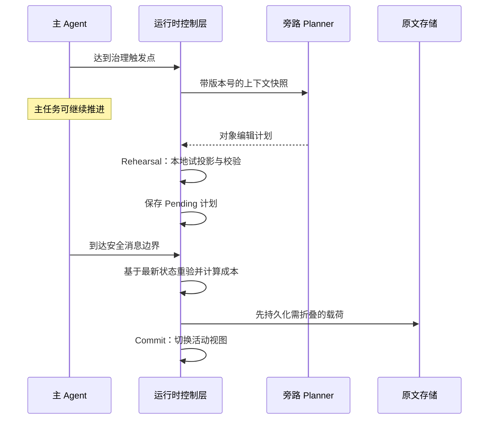
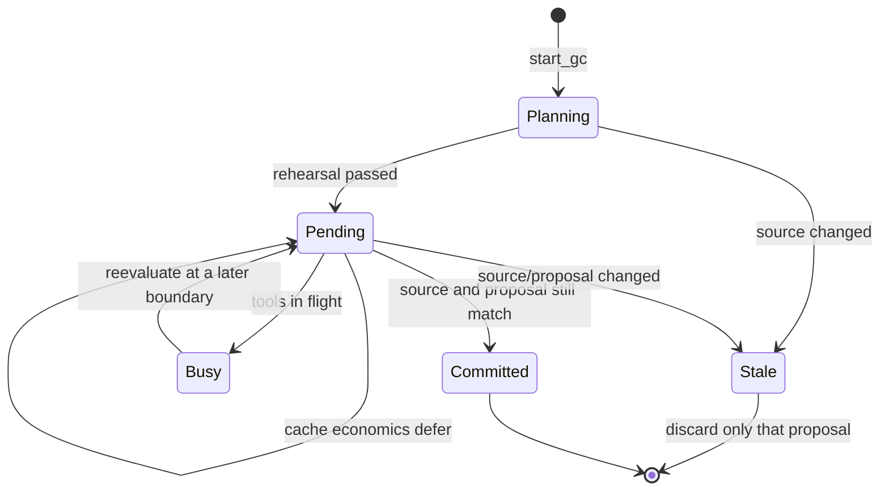
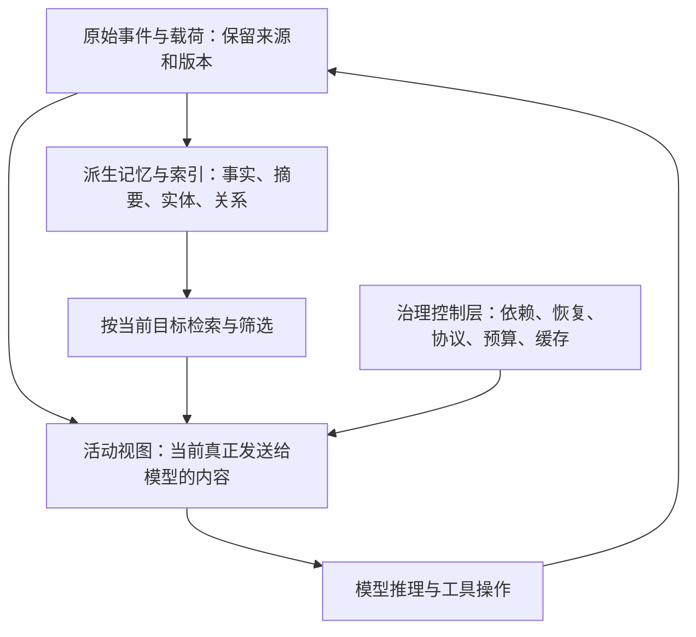

# 《Agent 上下文治理思考》学习笔记

建议分四遍读：第一遍读第 1—3 节建立概念；第二遍读第 4—10 节理解方法和原文推导；第三遍读第 11—16 节做工程推演、检查论证和自测；第四遍边运行第 19 节的实验，边对照实际代码。

- [1. 文章究竟在回答什么问题](#s1)
- [2. 必须先分清的基础概念](#s2)
- [3. 一个贯穿全文的案例](#s3)
- [4. Self-GC：把上下文当成有生命周期的对象](#s4)
- [5. PRISM：先找到证据，再控制证据预算](#s5)
- [6. SimpleMem：写入时把经历变成可检索的记忆](#s6)
- [7. MemGPT、Letta 与 LLMLingua](#s7)
- [8. Prompt Caching：为什么变短不一定变便宜](#s8)
- [9. 四个开源工具分别说明了什么](#s9)
- [10. 逐项理解原文的七个架构决策](#s10)
- [11. 两种模式与四组件方案怎样落地](#s11)
- [12. 完整走一遍上下文治理过程](#s12)
- [13. 怎样评估效果，避免被数字误导](#s13)
- [14. 原文需要修正或加条件的地方](#s14)
- [15. 用统一模型重新理解全文](#s15)
- [16. 自测题与参考答案](#s16)
- [17. 术语速查](#s17)
- [18. 原文页码与资料索引](#s18)
- [19. 从机制到可靠实现：三条可运行闭环](#s19)

## 1. 文章究竟在回答什么问题

### 1.1 用一句话概括主旨

**长任务 Agent 需要一个运行时系统，决定每一步让模型看到什么、保留什么、暂时移走什么，以及什么时候改变上下文才值得。**

这里包含四个不同问题：

1. **容量**：模型输入窗口有限，历史不能无限堆积。
2. **质量**：即使放得下，大量过时内容也可能干扰判断。
3. **连续性**：不能为了缩短输入而丢掉后续操作唯一依赖的证据。
4. **经济性**：减少 token 的收益，可能被缓存失效、压缩调用和恢复成本抵消。

原文最有价值的转变，是把关注点从“怎么缩短文本”移到“如何管理任务状态与证据”。

### 1.2 原文的五部分是怎样递进的

| 原文部分 | 它在做什么 | 阅读时应该问的问题 |
|---|---|---|
| 一、方案拆解 | 把论文、平台实践和工具拆成机制 | 这些方法分别改动系统的哪一层？ |
| 二、七个决策点 | 提出一个综合治理架构 | 哪些是已有结论，哪些是作者的设计？ |
| 三、两种模式 | 根据外部信息能否再访问选择策略 | 原始内容是否真的能重新取回？ |
| 四、面向 AI Coding 的四组件 | 从大架构删减成一个较小实现 | 宿主是否允许修改真正发给模型的消息？ |
| 五、探索价值 | 说明成本治理的长期意义 | 怎样证明单位成功任务的成本真的下降？ |

它是一篇技术调研加设计思考，不能把整篇当成一个已经完成统一实验验证的系统论文。特别是“把 A 的图、B 的分类器、C 的缓存策略合起来”属于架构提案；各零件有效，并不能推出组合后的系统一定有效。

### 1.3 一个很容易忽视的分类错误

Self-GC、PRISM、SimpleMem、MemGPT、LLMLingua、Prompt Caching 看起来都在“省 token”，但操作对象不相同。

| 方法 | 首先操作什么 | 主要回答什么 |
|---|---|---|
| Self-GC | 正在进行的会话中的上下文对象 | 哪些历史对象可以移出当前输入？ |
| PRISM | 外部结构化记忆中的证据候选 | 这次问题应取回哪些证据？ |
| SimpleMem | 即将写入长期记忆的交互内容 | 怎样写成紧凑、自足、可检索的记忆？ |
| MemGPT | 工作区与外部存储之间的数据 | 模型如何主动管理有限工作区？ |
| LLMLingua | 准备送入模型的文本 token | 哪些 token 可以在压缩预算下省略？ |
| Prompt Caching | 相同输入前缀对应的计算 | 哪些计算可以复用？ |

因此，在没有共同任务和评价口径时，不能给 Self-GC 和 PRISM 作笼统排名。先确定瓶颈出在历史治理、检索、写入记忆还是重复计算；在共同任务上，它们及其组合仍然可以做端到端比较。

## 2. 必须先分清的基础概念

### 2.1 Agent Loop：为什么历史会不断增长

一个简化的 Agent 循环如下：

```text
用户目标
  -> 构造本次模型输入
  -> 模型决定下一步
  -> 调用工具
  -> 获得结果
  -> 更新任务状态和历史
  -> 再次构造输入
  -> ...直到任务完成
```

模型可能只生成一句“读取这个文件”，但工具会返回几千行内容。真正膨胀的往往是工具结果，而非用户的几句话。

许多 API 调用在逻辑上需要重新提供会话历史。服务端可能复用前缀计算，但这不改变模型本次输入所包含的内容。**模型并不是因为上一次看过某文件，就会在下一次不提供该文件时仍然精确记得全部内容。**

### 2.2 五种“保存”绝对不能混为一谈

| 层次 | 例子 | 模型本次能否直接利用 |
|---|---|---|
| 原始事件记录 | 完整聊天、工具输入输出、时间戳 | 只有被放入当前输入的部分可以直接利用 |
| Active View，活动视图 | 本次真正发给模型的消息集合 | 可以 |
| 外部记忆或原文仓库 | 文件、数据库、向量库、sidecar | 需要检索或读取后进入输入 |
| Prompt Cache | 服务端对相同前缀的计算复用 | 仍须满足相应请求与缓存匹配条件 |
| 模型参数 | 训练时学到的语言和知识模式 | 不能当成本会话精确日志的替代品 |

文章后半部分的“非破坏性”主要指：**活动视图可以变，原始记录保留。**

这类似数据库视图。底层表有一百万条记录，查询结果只显示二十条；查询结果少了，不代表底层记录被删除。

### 2.3 token、字符、字节、费用是四种量

token 是模型分词后的单位；字符是文本单位；字节是编码后的存储单位；费用是计价规则作用于实际使用量的结果。

因此：

- 输出从 880 KB 变成 403 KB，直接证明的是字节体积下降。
- 不同类型文本的 token/字节比例不同，不能直接认定 token 同比下降。
- 输入 token 下降，也不能直接认定账单同比下降，因为缓存读写价格不同。
- 单轮账单下降，不代表整个任务更便宜；任务可能多重试了两轮。

### 2.4 为什么累计输入可能近似二次增长

**【讲解示例】** 设固定提示词长度为 `P`，每轮新增 `d` 个 token，所有历史都继续发送。第 `t` 轮输入近似为：

```text
L(t) = P + t × d
```

运行 `T` 轮，总输入量约为：

```text
Total = T × P + d × T × (T + 1) / 2
```

新增历史会在后续轮次被重复带入，所以累计输入量中出现平方项。它描述的是一个简化的会话计数模型，不是所有系统的推理复杂度定律，也不是已经考虑缓存后的账单公式。

一个旧工具结果如果有 8,000 token，并在之后 20 次请求中继续出现，就贡献了 160,000 个“重复输入 token”。缓存可以降低这些 token 的价格，但它们仍占据逻辑上下文空间。

### 2.5 压缩、摘要、折叠、检索、缓存有什么区别

**摘要**：用更短的语义表达替代原文，可能丢失精确措辞。

**抽取式压缩**：从原文选择片段或 token，通常不生成全新内容，但仍可能删除关键关系或否定词。

**折叠**：把大块内容移到外部，当前只留下恢复入口。

**检索**：根据当前问题，从更大的信息集合里选择材料。

**缓存**：让完全或部分相同的输入复用已有计算。

把五者放进一个文档问答例子：

```text
完整报告放在文件系统                 -> 存储
根据问题找到第 8 页                 -> 检索
只选这一页中有关预算的段落            -> 抽取
把段落改写成两句                     -> 摘要
移走全文，保留文件路径和页码          -> 折叠
下一轮重复发送相同报告前缀时复用计算   -> 缓存
```

### 2.6 “语义上差不多”为什么不一定够

用户要“解释错误原因”，一段摘要可能够用。

用户要“把第 37 行的 `timeout_ms` 改成 5000，其他字节不变”，摘要就远远不够。

上下文价值不是只看主题相关性，还要看任务要求的精度。可以把信息需求分为：

- 主题级：知道讨论过什么。
- 事实级：知道日期、数量、对象关系。
- 证据级：能指出原始记录支持什么。
- 操作级：能拿着精确 ID、路径、版本、句柄继续执行。

原文对“锚点”“可编辑工件”“活跃状态”的重视，主要是为了保护后两级。

### 2.7 模型内部到底发生什么：Attention、Prefill、Decode 与 KV Cache

先用三个词建立最低限度的计算直觉：**Q 是当前表示用来查找信息的查询向量，K 是历史位置的匹配向量，V 是匹配后读取的内容向量**。这里的 Q 不是用户自然语言问题本身，而是模型每一层、每个注意力头内部计算出来的表示。

典型注意力把 Q 与可访问的 K 做匹配，再按权重混合对应的 V。因果模型不能看尚未生成的未来 token；已经处理过的前缀可以保留各层 K/V，生成后续 token 时复用，避免重复计算这些历史 K/V。[Transformers 官方缓存原理](https://huggingface.co/docs/transformers/main/cache_explanation)

由此可以区分：

| 阶段或机制 | 在做什么 | 与上下文治理的关系 |
|---|---|---|
| Prefill，输入预处理阶段 | 处理本次输入，建立后续生成所需状态 | 输入过长会增加处理负担 |
| Decode，逐步生成阶段 | 根据上下文和已生成内容继续产生 token | 仍需要利用历史信息 |
| 单次生成中的 KV Cache | 复用已处理 token 的 K/V | 不用每生成一个 token 都从头重算历史表示 |
| 跨请求 Prompt/Prefix Cache | 在条件匹配时复用更早请求的前缀状态 | 相同输入前缀可以降低重复预处理的开销 |
| 模型内部 KV 压缩或驱逐 | 减少实际保留的内部缓存表示 | 操作的是推理实现层，不能等同于文本级 fold/prune |

跨请求复用与具体缓存类的差别，可参阅 [Transformers 官方缓存策略](https://huggingface.co/docs/transformers/main/kv_cache)。这里描述的是常见自回归 Transformer 的简化模型，不声称所有商业 API 都采用同一内部实现。

**【工程推论】** 这解释了为什么“命中了缓存”仍不等于“上下文没有负担”：历史仍参与当前生成的条件计算，缓存本身也需要存储。它还解释了两种优化为何互补：压缩在减少要带着走的信息，缓存在降低重复处理相同信息的成本。

不要将三个“复杂度”混为一谈：第 2.4 节算的是跨多轮累计输入；经典全注意力还涉及序列位置之间的计算；API 账单则依提供商的实际计价规则。一个量里出现平方项，不能推导出另外两个量也必然同样增长。

### 2.8 放得下、找得到、用得对，是三道门

有足够长的上下文窗口，只解决“系统接受这段输入”的容量条件。模型还要定位相关证据，再正确组合证据。

*Lost in the Middle* 在多文档问答和键值检索实验中观察到：相关证据位置改变会影响表现，某些受测模型对中间位置的利用弱于首尾。这支持“窗口容量不等于有效利用能力”，但不能推出所有现行模型都有同样的 U 形曲线，或存在通用的 200K 退化门槛。[原始研究](https://arxiv.org/abs/2307.03172)

**【讲解示例】** 同样有一个失败原因：

```text
状态 A：已经不在输入里，也没有恢复入口       -> 信息不可访问
状态 B：在输入第 8 万个 token 附近，但没被用到 -> 信息可见，利用失败
状态 C：被检索出来，却丢了否定条件             -> 表示失真
状态 D：证据完整，模型仍推理错                 -> 推理失败
```

四种失败应分别诊断。扩大窗口主要帮助 A 的容量问题；检索和排列可能帮助 B；保留原文与来源帮助 C；更好的推理与验证才可能帮助 D。单看一次错误答案，不能直接认定“应该再加一次压缩”。

## 3. 一个贯穿全文的案例

**【讲解示例】** 用户让 Agent 修复支付服务里的重复扣款问题，要求保持接口兼容，并且只在测试环境验证。

经过若干步，历史里有这些对象：

| ID | 内容 | 大小示例 | 后续价值 |
|---|---|---:|---|
| U1 | 不能修改公开接口，只在测试环境验证 | 100 token | 当前任务一直有效的约束 |
| T1 | 项目说明和测试约定 | 1,000 | 后续操作仍需遵守 |
| T2 | `payment.ts` 修复前版本 h1 的完整内容 | 8,000 | 可能需要对比原始实现 |
| T3 | 搜索结果，指向一个已经排除的模块 | 4,000 | 当前路径可能不再需要 |
| T4 | 首次测试失败日志，只有中间一行给出根因 | 10,000 | 中间那行是关键证据 |
| T5 | 把源码从 h1 改成 h2 的修复补丁 | 1,500 | 解释和审计需要 |
| T5R | 首次读取修复后 h2 的完整源码 | 8,000 | 继续检查当前实现 |
| T6 | 最新测试任务已启动，任务 ID 为 `job-781` | 300 | 需要继续查询结果 |
| T7 | 再次读取没有继续变化的 h2 源码 | 8,000 | 是否冗余取决于 T5R 是否仍可见 |

不同方法的想法不同：

- Self-GC：保护 U1、T1、T5、T6；考虑移走 T3；T2 可折叠；T4 不能随便掐掉中间。
- PRISM：用户问“为什么要加幂等键”时，取回包含根因、设计理由、补丁的证据。
- SimpleMem：把这次经历写成带项目、时间、原因和结果的记忆条目，供之后检索。
- MemGPT：模型主动把长期约束写进工作记忆，需要时搜索旧历史。
- LLMLingua：对选中的说明文本做 token 级压缩，但关键代码和精确证据应另行保护。
- 缓存优化：先计算改写这些旧对象会破坏多长的前缀，以及未来还能复用多少次。

T2 与 T5R 是同一路径的两个版本，不能互相去重；T7 才与 T5R 内容相同。

请一直记住 T7。它会揭示整篇文章一个非常重要的工程盲点：**文件未变化，只能证明内容一致，不能证明模型当前仍然看得到上一份内容。**

## 4. Self-GC：把上下文当成有生命周期的对象

本节主要依据用户提供的 Self-GC v1，尤其正文第 3—7 页及附录第 10—14 页；文末 [S1](#ref-s1) 给出文件与在线入口。

### 4.1 为什么先给每条内容一个 ID

假设你的历史是一大段字符串。想删除“第二次安装依赖产生的进度日志”，系统需要猜它从哪一行开始、在哪一行结束。只要出现相似文本，就可能删错。

对象化后，可以直接说：

```text
prune function:exec:17
```

它相当于为上下文增加可寻址性。ID 不是压缩本身，而是让压缩变成可以检查、重放和审计的操作。

论文实现用两类主要目标：

- `conversation:user:k`：一个用户请求及其后续执行跨度。
- `function:<tool>:n`：可以单独处理的工具跨度。

Assistant 消息并非同样自由的独立删除目标，因为它常包含连接文字与工具调用外壳。删工具结果时，还必须维护关联的消息结构。

**【资料核对】** 论文说 ID 由会话内单调分配器产生。原文称“全局唯一”不够严谨。跨会话定位时，应结合 `session_id` 使用。


### 4.2 JVM GC 的类比有用在哪里

**【资料核对】** Self-GC 论文中的名字展开为 *Self-Governing Context*，借用了垃圾回收的意象，并不只是 *Garbage Collection* 的另一个工具名称。[S1](#ref-s1) 首页就作了这个说明。

传统可达性 GC 从一组根对象出发，沿引用关系寻找仍然可达的对象。

套到 Agent：


```text
当前目标及仍有效约束
  -> 下一步操作
  -> 下一步操作需要的证据或工件
  -> 找回证据或工件所需的路径、ID、版本
```

一个对象很旧，不代表无用。用户第一轮说“不要改表头”，二十轮后仍然约束每次编辑。

一个对象很新，也不代表有用。刚刚搜索到一个明显无关的页面，可以立刻失去价值。


### 4.3 这个类比不能当成严格证明

程序里的引用关系往往显式存在；自然语言里的依赖通常隐式存在。更困难的是：用户下一轮可能提出新要求。

因此，Agent 的“活性判断”含有预测成分：

```text
基于当前任务，估计这个对象是否还会被用到。
```

它不是一个能准确知道未来的垃圾收集器。**“没有识别出依赖”不等于“依赖不存在”。**

稳妥的根集合也不应只有最近一句话，而应包括当前目标、仍生效的用户约束、未完成计划、活跃执行状态，以及必须遵守的任务契约。


### 4.4 直接依赖与桥接依赖

直接依赖容易理解：下一步要编辑一段 SQL，就要保留 SQL 本体。

桥接依赖更容易丢失：历史里有一句“最终报告写在 `report-final-v3.xlsx`，之前的 `report-v2.xlsx` 已废弃”。这句话本身不是报告内容，却告诉 Agent 应该打开哪个版本。

如果只保留两个文件路径，删掉这句连接信息，Agent 可能继续修改旧文件。

因此，对象价值可以来自三个位置：

1. 它就是需要的数据。
2. 它提供进入数据的入口。
3. 它解释多个入口之间的关系与当前状态。

第三种就是许多普通摘要最容易漏掉的内容。


### 4.5 fold、mask、prune 是三个不同承诺

| 操作 | 活动视图发生什么 | 恢复承诺 | 适合的内容 |
|---|---|---|---|
| fold | 大正文变成简短指针 | 保存可恢复的原始载荷 | 大文件、报告、以后可能再编辑的正文 |
| mask | 保留部分结构，省略中间 | 不能仅凭可见部分还原全文 | 真正重复、低信息量的日志段 |
| prune | 从活动视图移除对象 | 该操作本身不保证模型能找回 | 已过时且依赖已解除的过程内容 |

原文的“首尾各 10%”“固定 sidecar 路径”等是其介绍的实现细节，不应当成机制必须遵守的普遍标准。

`sidecar` 指旁路保存原始载荷的文件或对象存储。模型看到类似：

```text
[object-ref:function:read:12]
说明：支付模块修复前完整代码
恢复入口：sidecar://session-7/function-read-12
```

这里的 URI 是讲解用的示意标识，不是现成可调用 API。


### 4.6 为什么“100% 可回填”有前提

即使字节都保住了，也还需要：

- 指针没有被后续压缩掉。
- 对应文件仍存在且权限允许读取。
- 模型知道何时需要恢复。
- 恢复工具能准确找到目标。
- 当前窗口还有空间容纳要读回的内容。
- 图片、二进制、多模态信息有专门的保留与恢复路径。

“原文存储完整”“恢复接口成功”“模型恢复后做对了任务”是三个不同指标。Self-GC 论文也将视觉与二进制恢复测试列为后续需要补强的方向。


### 4.7 为什么不能对所有大输出保留首尾

回到 T4：错误原因恰好在 10,000 token 日志的中间。如果保留前后 10%，你得到了一份更短、更干净、却没有诊断价值的日志。

类似内容还有：

- diff 中间唯一一行错误修改。
- 表格中间唯一异常的一条记录。
- 堆栈中真正触发异常的调用帧。
- 长文中唯一写明例外条件的段落。

结构重复只是候选信号，不能推导出中间全部无关。mask 的正确对象是经过判断的重复跨度，而不是简单满足“大于某个 KB”的任何文本。


### 4.8 GC-Planner：语义判断与执行权分离

原文描述一个按顺序工作的规划 prompt。理解其结构比记“180 行”更有价值：

```text
排除不能动的对象
  -> 查仍然存在的直接和桥接依赖
  -> 找明确过时的内容
  -> 选择尽可能精确的操作粒度
  -> 选择 fold / mask / prune
  -> 检查整份计划是否自洽
```

最后一步很关键。单独看两个编辑都安全，合起来可能不安全：一个编辑删掉正文，另一个删掉恢复指针，最终就失去了两条访问路径。

输出空计划是一种正常结果。系统不应把“每次必须省出一些 token”当成目标，否则模型会被激励去寻找不安全的删除机会。


### 4.9 Fork、Rehearsal、Pending、Commit 分别负责什么



- **Fork**：规划器看副本，减少对主任务的直接干扰。
- **Rehearsal**：在本地模拟视图变更，检查 ID、冲突、消息结构与节省量。不是重新运行整个真实任务。
- **Pending**：计划先等待，尚未影响主视图。
- **Commit**：在合适时机，把经过重验的计划真正应用。

这与数据库事务的思想相似：先构造候选变更，再校验并提交。

**【资料核对】** 论文描述 token 压力、轮次边界或策略触发治理。它没有把“每次交互都必须完整执行一个 Fork”规定成所有部署都要遵守的机制。原文较具体的持续哨兵说法，不应代替论文的通用定义。


### 4.10 异步为什么会产生新的安全问题

假设 Planner 在版本 `v10` 认为某报告已完成，可以折叠；主 Agent 此时已经进入 `v12`，用户刚要求逐字修改报告。

`v10` 的计划不能因为“已经算完了”就无条件提交。

**【工程推论】** Pending 计划应带快照版本，提交前对照最新状态检查目标是否新近被引用、是否有新的用户约束、相关对象是否已改变。不满足条件就缩小计划或重算。

这相当于并发控制中的过期快照问题。异步省的是等待时间，不会自动消除一致性风险。


### 4.11 Self-GC 的实验证明了什么

| 数据集/部署 | 论文报告结果 | 正确理解 |
|---|---|---|
| 33 个困难会话 | 裁剪 43.95%，no-impact 84.85% | 在特定离线评估中，以较保守裁剪换取更好依赖保留 |
| 332 个生产来源会话 | 三种 Planner 的 no-impact 为 91.27%—94.58% | 不只在一个 Planner 模型上成立 |
| 在线账号分组 | 白天主 Agent 平均输入 token 降低 10%—15% | 表明实际输入规模下降，不等于完整账单同比下降 |

no-impact 是裁判模型利用真实后续会话检查“所需证据是否还存在或可恢复”。它不是一次端到端任务重跑的成功率。

困难集的 84.85% 对应 33 个样本中的 28 个；95% 置信区间为 69.08%—93.35%。小样本意味着估计仍有较大不确定性。

在线分组按账号邮箱首字符进行，论文明确说它不是完全随机的质量实验；线上输入指标也没有替代包含 Planner 在内的完整计费审计。

所以可接受的结论是：**该方法展示了比所测启发式基线更好的“裁剪—依赖保留”折中，并有线上输入减少证据。**不能扩写成“彻底解决安全压缩，已经证明总费用下降 44%”。


### 4.12 再往深一层：Mark 是依赖闭包，Compact 是重建视图

**【讲解示例】** 假设下面的箭头表示“左边需要右边才能继续”：

```text
下一步修复 -> 约束 U1
下一步修复 -> 任务句柄 T6
下一步修复 -> 当前源码入口 P
当前源码入口 P -> 当前源码正文 T5R
```

从“下一步修复”出发，不但 U1、T6、P 是活的，P 指向的 T5R 也在依赖闭包里。即使任务文本没直接提 T5R，也不能仅据此移除最后一条访问路径。

当整份计划包含多个删除动作时，要对**编辑后的图**重新验证闭包：原文在、指针在，各自单独通过检查，并不意味着二者仍连接正确。实现可用队列或深度优先遍历处理明确引用；语义依赖则还需要保守判断。这里是对原文图化方案的解释，不表示 Self-GC 原论文已实现了这份显式图算法。

Mark-Compact 类比中的 Compact，在传统 GC 里涉及整理存活对象及其引用；本文场景中更接近重建精简消息视图和恢复引用。它不会直接移动 JVM 堆对象，也不会自动解决自然语言依赖是否正确的问题。

**相关边与依赖边要分开。** “同一客户”“语义相似”可以用于检索，但不是删除安全性的证明。若把所有相似关系都当成强依赖，几乎整张图都可能被保留；反过来，不能因为没有语义边就认定对象已经死亡。

论文里的 lineage repair 还涉及消息/对象祖先关系的修复。修复父 ID 和角色序列可以保证结构可用，却不能凭空补回失去的证据。**结构正确与语义连续是两项独立检查。**


### 4.13 Pending 必须是一项可恢复的事务承诺

**【工程推论】** “计划先放到 pending”只是开始。系统还必须定义：下一轮怎样找到它、缓存条件改善后怎样重试、进程重启后怎样恢复，以及旧计划失效后怎样清理。

一种常见的不完整实现是：后台 Future 完成后调用一次 commit；如果经济性不合适就返回 false。下一次轮询发现 Future 已经被清空，于是返回“没有工作”。数据库里虽然还有 pending，控制流程却再也不读取它。数据被持久化了，任务生命周期却没有闭合。

本原型现在将其写成明确的状态流：



其中 Busy 是一次检查的返回状态，不是一份需要覆盖原计划的替代文本。调用方使用 `resume_pending()` 或再次 `poll_gc()`，会读取 SQLite 中的计划。因源状态变化而 stale 时，必须重新规划；仅仅因为缓存过期而重试，不需要再花一次 Planner 推理成本。

还要检查**两种不同的一致性**：

| 检查对象 | 解决什么问题 | 为什么另一项不能替代它 |
|---|---|---|
| 源会话 revision | 规划之后用户、工具或视图是否改变 | 相同源状态可以产生多份不同计划 |
| 待提交计划的完整内容 | 当前执行的是不是仍被选中的那份建议 | 建议没变，也可能已经基于旧历史 |

例如，计划 A 和 B 都根据 revision 12 生成，但 B 已经替换 A。只比较 revision，执行器仍可能提交 A，然后把 B 从 pending 中删除。当前代码在提交事务中同时比较源 revision 和 `expected_pending` 的规范化内容。丢弃 stale 计划时，也只删除匹配的旧建议，不顺手删掉新建议。

这里比较完整规范化内容相当于比较“建议身份”。它不是加密授权：模型仍只有提建议的权力，保护根、依赖与工具协议由执行器另行检查。对应代码：`Store.commit`、`Store.discard_pending`、`Runtime.resume_pending`。


## 5. PRISM：先找到证据，再控制证据预算

本节依据用户提供的 PRISM v2，重点是第 3—9 页的设计、公式与消融实验，见 [S2](#ref-s2)。


### 5.1 原文有一个必须先纠正的概括

**【原文观点】** PRISM 的核心是“检索替代压缩”，原始信息全部保留。

**【资料核对】** PRISM v2 明确把自己定义为检索与压缩的联合方案。其四个模块是：

```text
N4：识别查询意图
  -> N2：按意图调整边成本
  -> N1：图上寻找候选证据
  -> N3：证据筛选与压缩
  -> 回答模型
```

原文漏掉了 N3 和 N4；其中 N4 是可选的混合意图路由扩展，关闭它不代表不做意图识别。N3 则是降低回答侧上下文规模的重要模块。理解这一点，后面的技术比较才不会偏离实际方法。


### 5.2 为什么只按向量相似度检索不总是够

向量检索把文本映射成一串数字，使语义接近的内容在向量空间靠近。

如果问“支付幂等键在哪个函数里实现”，相关代码和问题通常共享许多概念，向量检索可能很好用。

但如果问“为什么团队后来放弃 Redis 去重”，关键证据可能是：

```text
某次故障期间，缓存提前失效，导致重复请求再次进入支付链路。
```

这段话未必包含“放弃 Redis”的字面表达，但存在因果关系。图检索试图把这种关系显式存下来，再沿它找到证据。


### 5.3 四层节点究竟代表什么

| 节点 | 可以怎样理解 | 支付案例 |
|---|---|---|
| Entity | 跨片段共享的实体锚点 | 支付服务、Redis、幂等键 |
| FacetPoint | 从片段抽出的原子事实 | “缓存失效后重试重复进入支付流程” |
| Facet | 同一片段内一组相关事实 | 缓存去重的失效机制 |
| Episode | 原始会话片段 | 当天排查故障的一段完整讨论 |

`belongs_to` 把这些层联系起来。除此之外，还有五类横切关系：语义相近、时间、因果、演化、涉及实体。

因此是**一种层级关系，加五种横切关系**。原文的“五种边”若只指横切边没有问题；如果理解成全部边类型，就少算了 `belongs_to`。

这些节点是检索表示，不应全部等同成程序对象之间的真实引用。特别是模型抽出来的 `causal` 边，仍可能只是一个待核验的因果解释。


### 5.4 “最小路径成本”到底怎么算

PRISM 并没有抛弃 embedding。它先在四层节点上做向量检索，找到锚点，再沿预设类型的路径模板到达 Episode。

锚点成本可写成：

```text
anchor_cost(a) = 1 - cosine(query, embedding(a))
```

越相似，起点成本越小。

一条路径的总成本是：

```text
path_cost = anchor_cost
          + Σ(edge_cost + hop_penalty)
```

`hop_penalty` 是每多走一步的惩罚，防止任意绕远。

Episode 得分取到达它的候选路径中最低的成本：

```text
episode_score(e) = min(path_cost of permitted paths reaching e)
```

这里的“最短”是预设类型路径上的成本选择，不是在无限大的任意语义图里证明全局最优的答案。


### 5.5 Query-Sensitive Edge Cost 的直觉

**【讲解示例，数字为示意】** 同一个 Episode 可以从不同路径到达：

```text
路径 A：语义边
起点 0.10 + 边成本 0.40 + 步长惩罚 0.05 = 0.55

路径 B：因果边
起点 0.15 + 边成本 0.50 + 步长惩罚 0.05 = 0.70
```

普通问题可能选 A。如果问题是“为什么”，系统给因果边打折，例如乘以 `0.5`：

```text
路径 B：0.15 + 0.50 × 0.5 + 0.05 = 0.45
```

现在 B 更便宜。直觉是：用户在问原因，就提高因果证据在检索中的优先级。

“边更便宜”是检索评分规则，不是沿这条边实际调用 API 更省钱。


### 5.6 N3 证据压缩起什么作用

图上的结构相关性并不保证内容相关性。一个频繁出现的实体可能连接很多不相关片段。

PRISM 的 N3 让 LLM 读取问题与候选 Episode 的已有摘要，在候选束中选出更少的 Episode。论文配置示例为从 top-10 选 top-5，交给回答模型的也是更紧凑的证据上下文。

这主要体现为**在摘要表示上的内容筛选与候选束压缩**，不是只把所有找到的原文照搬进去，也不是一定逐 token 裁剪每个片段。

分工是：

```text
图结构：尽量把可能有用的证据召回。
内容判断：尽量去掉召回中的不相关证据。
回答模型：依据留下的证据作答。
```


### 5.7 N4：意图识别也要考虑调用成本

识别“这是时间问题还是原因问题”，不值得每次都无条件调用大模型。

PRISM 提供一个级联：

```text
明确关键词 -> 意图原型向量匹配 -> LLM 兜底
```

这和原文后面“便宜判断先做”的思想相通。但具体实验中，启用该扩展后只有 42.3% 的查询走无 LLM 的意图路由。更不能把它理解成整个 PRISM 流程没有 LLM 调用，因为 N3 仍需要模型。


### 5.8 结果与消融必须一起看

论文 LoCoMo 同协议结果如下：

| 方法 | LLM-judge 分数 | 每问回答侧上下文 token |
|---|---:|---:|
| Full Context | 0.481 | 26,031 |
| Mem0 | 0.669 | 1,764 |
| PRISM | 0.831 | 2,023 |
| PRISM 去掉 N3 | 0.825 | 4,108 |

这说明在该设置里，更少但选得更好的证据，可以比直接喂全部历史更有效。

然而，真正值得认真读的是第 8—9 页消融：

- 去掉 N3，回答侧 token 约翻倍，证据排序质量下降。
- 去掉关系路径 N1 或意图成本调整 N2，最终指标几乎不变。
- 论文检查发现，在 1,540 个问题中，1,536 个问题的相关消融候选集合完全相同。

所以不能说“实验证明带类型的图遍历是 PRISM 高性能的决定因素”。更准确地说：**方法设计支持关系路径，但这组数据中直接锚点检索已能覆盖大多数证据，关系路径的额外收益没有被显著展示出来。**

论文预期更需要跨桥接关系的任务会受益，这是合理研究假设，还需要相应实验。

同样，2,023 是回答侧上下文代理指标，不包含全部图构建、意图分类、证据筛选与输出开销。约 13 倍的上下文缩减不是端到端账单必然降低 13 倍。


### 5.9 Pareto-efficient 到底是什么意思

假设用两个维度评价系统：越准确越好，成本越低越好。

如果 A 比 B 更准确，而且不更贵，那么 B 被 A 支配。不能被其他方案同时在两项上击败的点，构成 Pareto 前沿。

它不意味着某方案对所有人都最优。例如，极低预算用户可能愿意牺牲一些准确率。比较还必须使用同一测量口径，不能把一个系统的检索 token 和另一个系统的完整费用放在一张图里。


### 5.10 “不删除，所以不会出问题”错在哪里

外部保留原文，确实降低永久丢失风险。但回答时仍可能：

1. 入库抽取漏了关键关系。
2. 实体合并把两个人混成一个人。
3. 检索没有召回正确 Episode。
4. N3 丢掉一个多跳推理必需的桥接片段。
5. 摘要已经省略原文细节。
6. 回答模型没有正确使用证据。

**存储召回不了的信息，对当次模型推理来说仍然不可用。**“可恢复”解决的是恢复潜力，不等于当次决策自动拥有完整信息。


### 5.11 top-K 并不等于 token 预算，证据也不总能逐条独立评分

**【工程推论】** `K=5` 只限制条目数。如果五个片段分别是 100、100、100、100、10,000 token，总体仍可能超预算。因此还需要统计最终拼装长度，并为问题、规则、工具和输出留空间。PRISM 的 `K`、`M` 是候选与筛选参数，不能代替整体输入预算。

还有一个更深的限制：证据可能有互补性。

```text
片段 A：任务编号 job-781 对应支付回归测试。
片段 B：job-781 在修复 h2 上通过，h1 上失败。
```

A 单独信息量不大，却让 B 能与当前项目和测试关联。如果只按每条片段的独立相似度取最高分，可能把 A 丢掉。

因此，“一个 Episode 有一条强路径足够证明相关”是 PRISM 最小路径评分的归纳偏好；它不等于“一个问题有一条相关路径就足够回答”。多跳问题仍可能需要多个 Episode 共同提供完整证据链。

这也说明了检索图与治理图的区别：前者帮助找到候选，后者必须进一步保护这些候选之间不可缺少的连接。


### 5.12 检索预算必须在请求装配后再次计算

**【工程推论】** top-K、正文 token 和完整模型请求长度是三种不同约束。假设检索器返回 100 个单位的正文，并不代表把它放进剩余 100 个单位的窗口就能成功。

完整请求还可能包含：

```text
稳定指令 + 工具 schema + 必须保留的历史 + 当前问题
+ evidence ID + source IDs + 信任标签 + JSON 包装与转义
+ 证据正文 + 为输出保留的空间
```

可以用下式建立预算直觉：

```text
B_evidence ≈ B_total − B_protected − B_template − B_query − B_output_reserve
```

但它不是对所有 tokenizer 都精确可加的等式。拼接和序列化可能改变分词边界，所以执行器应实际生成候选请求，再用目标模型的 tokenizer 计量。当前原型仍用明确标注的教学单位 `count()`，对真实 API 接入应替换计量器。

`pack_evidence` 的算法是：

1. 先装配没有新证据的请求，确认保护内容和问题本身装得下。
2. 按检索排序逐条尝试加入完整证据，同时放入其 source IDs。
3. 超过正文预算或完整输入预算，就跳过这条，并记录原因。
4. 继续尝试后续较小证据；不把一条证据任意截成首尾，也不因第一条太大就放弃整次检索。
5. 为输出保留预算，最终返回真正选中的 IDs 与 omitted 列表。

这是按顺序贪心装配，不是全局最优的背包求解。某个长证据可能很关键，跳过它会使答案无法确定。这时应该继续检索更细的、仍有完整语义的片段，或者明确承认证据不足；不能把“没有超限”误当成“能够答对”。

**【讲解示例】** 第一个候选包含 2,000 单位背景，第二个候选只含“网关已扣款”的 10 单位事实。剩余输入预算为 160，另需预留来源包装。第一项放不下时，系统仍可保留第二项。它改善的是请求可构造性，不证明第二项足够支持最终结论。

此外，两个候选若使用同一个 evidence ID，却带着不同正文，装配器会拒绝，而不是“后一个覆盖前一个”。不同 ID 的矛盾证据可以共同存在；同一个身份的冲突则意味着来源或版本建模已经出错。


## 6. SimpleMem：写入时把经历变成可检索的记忆

本节依据用户提供的 SimpleMem v3，见 [S3](#ref-s3)。


### 6.1 为什么写入时要加工

原始会话经常是这样的：

```text
甲：昨天和她讨论过那个方案了。
乙：她是什么时候同意的？对上线有什么限制？
甲：她昨天就同意了，但上线最早要等下周三。
```

这段话放回原会话里可能很清楚，单独从数据库取出来却不知所云。

长期记忆需要尽量成为“离开原文也能理解”的单元：谁、做什么、何时发生、有什么限制、依据哪里。

SimpleMem 主要把成本前移：写入时做语义整理，让以后每次查询更省力。


### 6.2 三合一变换具体做什么

假设这三条消息的编号是 31、32、33，发生于北京时间 `2026-07-04`；前文明确“她”是项目负责人王敏，“那个方案”是支付重试修复方案。这里还假设双方按星期一开始的一周理解“下周三”。这些前提共同支持下面的实体和日期转换。

**【讲解示例】** 可以生成这样的记忆：

```json
{
  "subject": "王敏",
  "event": "同意支付重试修复方案",
  "event_date": "2026-07-03",
  "constraint": "上线时间不早于2026-07-08",
  "source_turns": [31, 32, 33]
}
```

这同时完成三件事：

- 抽取有用事实，过滤没有新增信息的交互。
- 指代消解：把“她”“那个方案”变成明确对象。
- 时间锚定：把“昨天”“下周三”联系到绝对日期。

这是示意，不代表模型一定能从任何模糊话语推出上述确定事实。如果缺少参考时间、时区或指代证据，应保留不确定性，不能靠格式化制造精确感。


### 6.3 Entropy gating 不是机械计算香农熵

信息论中的熵通常写成：

```text
H(X) = -Σ p(x) log p(x)
```

但 SimpleMem v3 的语义密度门控是 LLM 在抽取过程中作的定性判断：一个窗口没有值得存储的新信息时，输出空集合。

它不是先跑一个便宜确定性公式，测出“熵低于 0.3”就扔掉该窗口。

同一句“好的”，在普通寒暄里几乎没有信息；在回答“是否批准发布”时却可能改变任务状态。字数少、出现频繁、容易预测，都不保证业务价值低。


### 6.4 三视图索引：三个入口指向同一条记忆

| 视图 | 长处 | 案例 |
|---|---|---|
| Dense semantic | 识别语义近似表达 | “重复付款”找到“重复扣款” |
| BM25 lexical | 精确词、罕见名称、代码标识符 | 查询 `Idempotency-Key` |
| Symbolic metadata | 日期、实体等确定条件过滤 | 只查 7 月发生的支付故障 |

最后按记忆 ID 合并去重：

```text
Result = SemanticResults ∪ LexicalResults ∪ SymbolicResults
```

这里的并集避免了“只依赖某一个评分体系”。但它并不自动保证最终预算够用：三个入口各取 20 条，去重后仍可能有 50 条，需要预算管理。

**【工程推论】** 检索还应区分硬性范围限制与背景材料。例如用户明确要求“只依据今年的记录”，应按此约束筛选；如果只是问“今年的决定为什么与去年不同”，去年的证据当然可以作为比较依据，但必须保留日期，不能冒充今年发生的事实。


### 6.5 Online Semantic Synthesis：防止事实碎片越攒越多

如果连续写入：

```text
用户要咖啡。
用户这次选择燕麦奶。
用户这次希望热饮。
```

可以在合适证据条件下合成一次订单相关的记忆：

```text
用户本次点了热燕麦奶咖啡。
```

注意“本次”很重要。不能没有依据就升级为“用户永远喜欢热燕麦奶咖啡”。语义合成容易把短期选择变成长期偏好，所以需要保留时间范围、来源和适用条件。


### 6.6 原文的“双层时钟”与提供版本不一致

**【资料核对】** v3 的核心三阶段是：

1. Semantic Structured Compression。
2. Online Semantic Synthesis。
3. Intent-Aware Retrieval Planning。

其中第二阶段明确强调在写入阶段、会话内部即时整合，并与依赖异步后台维护的方式作区分。

因此，原文所说的周期性 Recursive Memory Consolidation、跨会话图社区发现、从百次任务归纳失败模式，不能直接归为这份 v3 已实现且验证的机制。这些可以作为作者的扩展设计，但应换一个证据标签。

还有两处版本细节：

- 文件中的预印本时间为 2026 年，原文标成 2025 年不符合该版本。
- v3 正文使用窗口 `W = 20`，并非原文的 40 轮、重叠 2 轮。

论文附录 Table 7 自己也有值得核验的地方：同时写 `Sliding Stride = 5 turns` 与 `25% overlap`。按常规滑动窗口定义，窗口 20、步长 5 应有 15 轮重叠，即 75%。可能是作者将步长占比与重叠比例混写。实际复现必须查实现，不能盲抄任何一处数字。


### 6.7 “Semantic lossless”不能按 ZIP 无损理解

论文用“语义无损压缩”表达尽可能保留有效语义的目标，但生成式事实抽取无法承诺任意未来问题的原文细节都可重建。

例如两句话都可以概括为“用户不同意上线”，但用户到底说的是“今天不能上线”还是“通过审计前不能上线”，对后续动作完全不同。

若任务需要逐字引用，就应保留原始消息和来源指针。语义记忆可作为索引与摘要层，不应无条件取代原始证据。


### 6.8 写一次读多次，什么时候值得

**【工程推论】** 设：

```text
I = 一次入库整理成本
R0 = 原来的每次查询成本
R1 = 整理后的每次查询成本
Q = 未来查询次数
```

粗略盈亏条件是：

```text
Q × (R0 - R1) > I
```

还应补上索引维护、数据更新与错误修复成本。若一个临时文件只问一次，花很大代价建长期记忆未必划算；如果未来反复查询同一批历史，前期整理更容易摊销。


### 6.9 数据怎么读

论文在 GPT-4.1-mini 的 LoCoMo 表格中给出 SimpleMem 平均 F1 为 43.24，Mem0 为 34.20。

```text
绝对差 = 43.24 - 34.20 = 9.04 个百分点
相对提升 = 9.04 / 34.20 ≈ 26.4%
```

这不是“准确率提高 26.4 个百分点”。F1 与 PRISM 使用的 LLM-judge 分数也不是同一指标，不能直接将 43.24 与 0.831 排名。

论文中约 30 倍的 token 缩减主要对应检索/回答时的上下文用量比较，不能当成已经计入写入整理的全生命周期成本缩减。


### 6.10 Intent-Aware Retrieval Planning：怎样生成本次检索计划

SimpleMem 不只是“写得更好，然后三路各搜一下”。v3 第 2.3 节还让模型根据问题 `q` 和当前历史 `H` 生成：

```text
P(q, H) -> {q_sem, q_lex, q_sym, d}
```

- `q_sem`：适合语义搜索的表达。
- `q_lex`：用于精确匹配的关键词、姓名或标识符。
- `q_sym`：日期、实体等结构化过滤条件。
- `d`：所需检索深度的估计，用来调整候选量；不是图遍历跳数。[S3](#ref-s3) §2.3。

**【讲解示例】** 用户问“7 月改掉缓存去重以后，重复扣款是否还出现过”：

```json
{
  "q_sem": "缓存去重方案变更后的重复扣款复发及验证结果",
  "q_lex": ["重复扣款", "幂等键", "payment"],
  "q_sym": {"project": "payment", "event_date_start": "2026-07-01"},
  "depth_reason": "需同时核对方案变更、变更后事件和验证记录"
}
```

这是讲解 schema，不是论文的精确 API。相比“支付模块叫什么”这种简单定位问题，它需要覆盖更多条证据，不能固定只取一条。

因此，SimpleMem 的成本并非全在写入端；检索规划本身也会用模型。它与 PRISM 的区别是：前者生成多视图查询与检索深度，后者的意图路由主要影响类型路径的评分。不要把两个不同的 Planner 因为都叫“意图感知”而合并成同一模块。


### 6.11 记忆更新要区分“更正旧事实”和“事实随时间变化”

**【工程推论】** 如果 7 月 1 日记下“测试命令是 `npm test`”，7 月 10 日用户说“项目现已迁移，之后使用 `pnpm test`”，不能简单认定前一条从来就是错的。

至少区分：

```text
observed_at：系统什么时候得知这条信息。
valid_from / valid_to：这条信息适用于哪个时间范围。
supersedes：哪条新记录替代了哪条旧记录的当前适用性。
source：谁提供的依据，针对哪个项目或版本。
```

问“现在怎么测试”应取新规则；问“7 月 5 日为什么运行 npm”则要查当时有效的规则。如果用户说“你上次理解错了，我们一直使用 pnpm”，这才是对旧记录真实性的更正。

记忆合并还应保留否定、例外和条件。例如“仅测试环境可用”不能被抽取成“可用”。“未知是否通过”也不能因没有失败记录而升级为“已通过”。结构化不意味着事实已经完整，版本化也不意味着冲突自动消失。


### 6.12 更正应指向记录，失败写入应有事务边界

**【工程推论】** 第 6.11 节列出的时间模型，不能只用一个布尔值 `correction=true` 代替。尤其不要把“更正 A”实现成“让同一实体、同一槽位的所有其他值失效”。

例如已有两条不同情境下的记录 A、B，新信息 C 只指出 A 有误。正确关系为 `C → supersedes → A`，B 仍可检索。当前原型增加了显式字段：

```json
{
  "entity": "Ada",
  "slot": "plan",
  "value": "C",
  "text": "Ada 的方案记录更正为 C。",
  "date": "2026-09-07",
  "supersedes": ["memory-id-of-A"]
}
```

目标必须存在且属于同一实体和槽位；显式 ID 能收紧操作范围，但仍不能自动证明“C 真的纠正了 A”。这属于语义裁判或人工标注要确认的部分。

兼容旧输入的 `correction=true` 只在较早观测到的记录中推断候选，不把后续观测一并失效。实现里的 `observed_seq` 是会话内的观测顺序，不是 UTC 时间，也不是完整的双时态数据库。跨会话或同一事实在不同时点的适用性，仍需更丰富的业务时间模型。

必须检查更正环。例如 A supersedes B，同时 B supersedes A，默认检索会把两者都排除。当前存储层在事务内用有向图检查更正关系；出现环就回滚整个窗口。检查“source ID 存在”不能发现这种关系错误。

另一条边界是批量抽取失败：一个窗口中模型给出两条事实，第一条合法，第二条引用了不存在的 source ID。如果验证一条就立即写一条，抛错后数据库已经半更新。重试时系统面对的初始状态就不再相同。

本实现先验证和规范化整个窗口，再调用 `put_memories` 在一项 SQLite 事务中合并来源并写入。窗口内任一事实失败，这个窗口的派生记忆不落库；之前成功的窗口仍保留，原始对象和失败审计记录也保留。这是**窗口级原子性**，不是整个会话处理的全有或全无。

重复摄取相同事实时，规范 ID 和来源集合合并使其不会无限新增。更正关系也保留，重放旧输入不会自动复活已被明确更正的记录。对应回归测试同时检查：只更正指定目标、重复摄取稳定、错误窗口不留半条结果、更正环被拒绝。


## 7. MemGPT、Letta 与 LLMLingua


### 7.1 MemGPT：把有限上下文当成工作内存

MemGPT 的核心类比是操作系统的虚拟内存：磁盘里可以放很多内容，但 CPU 运行时只能直接处理已经调入工作内存的数据。

对应到模型：

```text
当前模型输入 = 工作内存
历史消息库、归档知识库 = 外部存储
检索工具 = 把外部信息调入当前输入的通道
记忆编辑工具 = 更新常驻工作区的接口
```

用户提供的 MemGPT v2 把主上下文分成系统指令、可编辑 Working Context、滚动 FIFO 消息队列；外部包括 Recall Storage 与 Archival Storage。队列管理器持久化消息，在内存压力下警告模型，并在需要时整理、驱逐旧队列内容。详见 [S4](#ref-s4) 第 2—4 页。

原文用 Core Memory、Recall、Archival 三分法帮助理解没有大问题，但混入了后续 Letta 产品名称、工具名及数据库实现。不要把它们全部当作 2023 年原始论文中的固定接口。


### 7.2 模型“自己管理”到底意味着什么

模型可以主动调用工具：

```text
把“用户要求所有报告使用人民币”写入工作记忆。
搜索去年与这个客户的约定。
把不常用的细节存入归档。
```

优势是：模型知道当前任务，能在自然边界作出有语义的记忆操作。

代价是：它需要消耗推理和工具调用来管理记忆，也可能漏存、错存、找不到资料。

**原文“没有外部治理层”的说法过于绝对。** 论文中明确有 Queue Manager、Function Executor、内存压力警告和消息驱逐机制。更准确的区别是：语义上的记忆编辑与搜索，更多由执行任务的模型主动发起。

#### 从内存压力到连续检索：MemGPT 的控制流

根据 [S4](#ref-s4) §2.2—2.4，可以把一轮展开为：

```text
用户问题进入 FIFO 队列
  -> 工作区里没有所需事实
  -> 模型调用历史检索函数
  -> 检索结果以受限分页返回
  -> 模型请求继续执行，补查下一页或查询归档
  -> 证据足够后回答用户
```

论文使用 `request_heartbeat=true` 让函数执行完后继续一次模型推理，支持不等待新用户消息的连续工具调用。这里的 heartbeat 是当时架构的控制流参数，不要将它自动等同为某个现行产品中的定时任务。

队列压力警告的作用，是在旧消息被移出之前给模型机会把重要内容写入工作区或归档；分页则防止“好不容易释放窗口，一次检索又全部塞满”。外部记忆很大，也仍需要严格控制每次调入的工作集。


### 7.3 Sleep-time：把整理移到后台

后台整理的直觉很简单：交互进行时优先响应，间隙再复盘和维护长期记忆。

但要区分两件事：

- 更新记忆文件或数据库，属于外部状态变化。
- 用整理后的数据训练模型，属于参数更新。

前者不会自动变成后者。“越来越了解用户”可以来自更好的外部记忆，不一定意味着模型权重被重新训练。

现行 Letta 文档把后台整理称为 dreaming，并描述后台任务合并经验、更新记忆。这是后续产品实践，不能倒灌成早期 MemGPT 的原始贡献。[Letta 官方记忆文档](https://docs.letta.com/configuration/memory)


### 7.4 LLMLingua：在 token 层面做取舍

LLMLingua 系列的主要差别可以先记成三个问题：

| 方法 | 核心问题 |
|---|---|
| LLMLingua | 在预算下，怎样借助小语言模型的概率信号压缩文本？ |
| LongLLMLingua | 已知当前问题时，哪些内容对这个问题更重要？ |
| LLMLingua-2 | 能否直接训练一个高效的 token 保留分类器？ |

原始 LLMLingua 不只是“按困惑度删词”，还包括预算控制与迭代压缩，以降低过度删减带来的语义损失。[原始论文](https://arxiv.org/abs/2310.05736)

语言模型对 token 的惊讶程度可粗略写成：

```text
surprisal(token) = -log P(token | 前文)
```

常见、容易预测的词，惊讶程度低。但这只是统计信号，不是业务重要性的定义。“不”字很常见，删掉却可以完全反转要求。

LongLLMLingua 加入问题相关信号，并结合文档级选择、排序及细粒度压缩，减少与问题无关的输入。[LongLLMLingua 论文](https://arxiv.org/abs/2310.06839)

LLMLingua-2 从强模型产生的压缩数据学习 token 保留判断，使用双向编码器，支持不依赖具体查询的压缩。论文报告的 3—6 倍加速是相对已有压缩方法的压缩器速度，并不等于整个 Agent 自动快 3—6 倍。[LLMLingua-2 论文](https://arxiv.org/abs/2403.12968)


### 7.5 为什么 token 分类器不能直接成为安全 GC

一个分类器可以判断某个词是否适合在训练任务的压缩目标下省略，却未必知道：

- 这串数字是唯一可等待的后台任务句柄。
- 用户下一步会要求逐字引用这段话。
- 这个看似普通的文件路径指向唯一正确版本。
- 这条错误记录解释了为什么不能重复尝试同一操作。

因此，原文把 LLMLingua-2 放进“规则—分类器—小 LLM—Planner”级联，是一个迁移设计，不是论文已经验证的对象存活性系统。

合理用法是让分类器处理经过限定的低风险文本类别，而把精确证据与活跃状态交给有更强保护约束的机制。


### 7.6 把“困惑度打分”再讲准确一点

严格地说，单个已观察 token 的负对数概率是 surprisal；序列 perplexity 通常是平均负对数概率的指数：

```text
h_i = -ln P(x_i | x_<i)
PPL(x_1...x_n) = exp((h_1 + ... + h_n) / n)
```

直觉上，它反映模型对这段文字有多不确定。原文把几种信息量术语简写在一起，容易让人误以为“困惑度就是任务价值”。二者没有这样的等价关系。

原始 LLMLingua 先给指令、问题、示例分配不同预算，再按压缩后前文迭代评估，避免所有部分被同一比例粗暴裁剪。小模型还要尽量对齐目标模型的分布。[LLMLingua §4](https://aclanthology.org/2023.emnlp-main.825.pdf)

LongLLMLingua 的对比思路是看“加入问题后，token 的预测信号改变了多少”。可以用下面的负对数概率差理解这一方向：

```text
s_i = h(x_i | 前文) - h(x_i | 问题, 前文)
    = ln[P(x_i | 问题, 前文) / P(x_i | 前文)]
```

这里统一使用负对数概率记号，便于理解它与条件信息关联的关系；原论文 §4.1 用 contrastive perplexity 表述其评分。不能把序列 PPL 指数值的差、平均交叉熵差和单 token 的对数概率比分别实现后，仍声称数值完全相同。[LongLLMLingua §4.1](https://aclanthology.org/2024.acl-long.91.pdf)

**【讲解示例】** 某 token 在普通前文下概率为 0.01，加上问题后为 0.10，则这个对数比为 `ln(10)≈2.30`。另一个两种条件下都为 0.20 的词，得分为 0。这里衡量的是问题带来的关联信号，不是判断该词可以绝对安全删除。

LLMLingua-2 则把学习目标直接改成 token 保留/丢弃分类：从强模型压缩结果构造监督标签，再训练双向编码器估计保留分数。因此它不必在每次运行时调用强模型重新决定每个标签。[LLMLingua-2 §3—4](https://aclanthology.org/2024.findings-acl.57.pdf)

抽取式输出没有新添词，不代表语义必然忠实。例如从“只有通过审计后才允许发布”中抽出“允许发布”，每个字都来自原文，条件却消失了。这也是将 token 压缩用于任务契约时仍要额外保护的原因。


## 8. Prompt Caching：为什么变短不一定变便宜

这是理解原文工程判断的关键一节。概念依据用户提供的两份 Claude 官方网页；补充价格口径以核对当天的 API 文档为准，见 [S5](#ref-s5)、[S6](#ref-s6)、[S13](#ref-s13)。


### 8.1 缓存的是前缀计算，不是“相似意思”

设前一轮请求为：

```text
[固定工具与系统信息 A][项目规则 B][历史 C][新消息 D]
```

后一轮为：

```text
[固定工具与系统信息 A][项目规则 B][历史 C][新消息 D][新消息 E]
```

前面相同的部分可能复用。

如果改为：

```text
[固定工具与系统信息 A][改过的项目规则 B'][历史 C][新消息 D][新消息 E]
```

即使 C、D 的字面内容没变，从 B' 开始的连续前缀已经不同，后面的计算通常不能作为旧前缀直接复用。

不能把它想成浏览器对每个独立文件的缓存，也不能想成向量库的语义匹配。对于自回归模型，同样一段后缀出现在不同前文后面，其上下文化表示可能不同。

实际命中还取决于模型、缓存范围、断点、有效期、最小长度及平台实现，不是只看字符串相等。这里说的稳定性是平台实际处理的提示内容与相关参数稳定；不应把它绝对化为“HTTP 请求 JSON 的任意空格或字段顺序变化都必然破坏缓存”，因为服务端可能先解析或规范化外层请求。


### 8.2 为什么稳定的东西放前面

设计原则是让变化尽量发生在末尾。例如：

```text
稳定工具定义与系统规则
  -> 相对稳定的项目说明
  -> 已积累且顺序不变的历史
  -> 本轮检索结果、状态更新与新消息
```

如果把“当前时间精确到秒”放在最开头，每轮都变，后面大量相同历史也无法命中原前缀。

写进提示正文的 JSON 字符串顺序、工具定义顺序、随机生成的说明文字，也可能产生类似问题。因此“语义没变”不能保证缓存稳定。


### 8.3 “这个区域没有设置缓存”不等于修改成本为零

假设有：

```text
[稳定系统][动态检索结果][稳定历史][缓存断点]
```

动态检索结果即使自身未单独放断点，只要后面的缓存前缀包含它，它一变，后面的前缀仍会变。

只有把它放在相关可复用前缀之后，且后面没有你打算复用的旧缓存部分，才可以说它不破坏那一段旧前缀。

因此原文“L2 Active View 本身不缓存，所以修改成本为零”需要补充严格的排列和断点条件。给区域起个名字，不能改变前缀依赖关系。


### 8.4 Claude Code 与 llmbuffer 应当分开理解

用户提供的 Anthropic 博文支持以下原则：固定内容在前；变化通过后续消息传入；尽量保持工具定义和模型稳定；旁路压缩调用复用父会话前缀。

原文里的“四层 llmbuffer 排列、15 轮 85.3% 命中率、约 43% 成本下降”则可以追溯到独立的 llmbuffer 项目示例，不是 Claude Code 官方生产实验。

该示例表中估算费用为 `$0.016` 对 `$0.028`，相对下降约 42.9%；同时页面提供模拟与在线 benchmark 运行方式。不能仅凭这张表判断它就是官方线上实测，更不能推断所有会话都能节省同样比例。[llmbuffer 项目说明](https://pypi.org/project/llmbuffer/)


### 8.5 缓存有写入价、读取价和有效期

以核对当天官方文档的**标准倍率**为例：5 分钟缓存写入为普通输入价的 `1.25×`，1 小时为 `2×`，读取通常为 `0.1×`；文档也列出部分型号的读取例外，因此实际应按具体模型取价。原文“缓存写原价”不能直接用于计费实现。[Claude API 缓存定价](https://platform.claude.com/docs/en/build-with-claude/prompt-caching)

下面的计算统一采用：

```text
普通输入价格 p = 1 个成本单位/token
缓存读取价格 r = 0.1
5 分钟写入价格 w = 1.25
```

这是便于算账的标准化示例，不是某个模型的美元报价。


### 8.6 两个必须分开的压缩阶段

**阶段 A：产生压缩结果。**

让模型看到旧历史，再附加“请总结”之类的指令。如果系统提示词、工具和历史保持一致，这个生成摘要的调用可以命中旧前缀。

**阶段 B：下一次真正使用压缩后的历史。**

旧历史被摘要或指针替代，输入结构发生变化。被替换位置之前的共同前缀可保留，但之后的旧缓存通常需要重新建立。

```text
生成摘要：
[A][B][C][D] + [请压缩]       旧前缀可复用

继续任务：
[A][B][摘要 S] + [下一步]     C 所在位置开始改变
```

原文最后说“压缩结果 append 为新 user message，不修改前缀”，与真正回收历史空间不是一回事：

- 只 append 摘要，旧历史仍发送，输入反而更长。
- 要缩短输入，就必须在投影或新会话里替换、移走部分历史。

Anthropic 的 cache-safe forking 解决的是阶段 A 不要额外付出一次完整冷输入成本，不是消除阶段 B 的全部缓存重建成本。


### 8.7 一个完整的盈亏公式

原文末尾给出：

```text
Token Saved × Cache Read Price
  - Tokens Invalidated × Cache Write Price
```

它有启发性，但遗漏未来复用次数、原本也要支付的读取费，以及 Planner、摘要输出、恢复等开销。还应注意决策时点：规划尚未发生时要算规划费；计划已经产生、仅决定是否提交时，已经支付的规划费是两条路径共有的沉没成本。第 8.14 节会将这两种账拆开。

最可靠的定义是直接比较两个未来：

```text
NetBenefit
  = 未来不压缩的总成本
  - 未来压缩后的总成本
  - 本次治理额外成本
```

Self-GC 论文第 3 页也使用包含未来调用次数与 GC 开销的近似：

```text
CommitBenefit ≈ Nfuture × (C - C') - Lcache_break - LGC
```

这里所有项要统一成成本，而不是把 token 数和金额直接相减。


### 8.8 推导一个可手算的简化模型

**【讲解示例】** 假设：

- 即将受本次编辑影响的旧缓存区间长 `I` token。
- 编辑后该区间净减少 `S` token；摘要和指针已算入净减少量。
- 未来还会请求 `N` 次，缓存始终有效。
- 不编辑时，该旧区间未来每次都按读取价 `r` 收费。
- 编辑后第一次把保留下来的 `I-S` token 按 `w` 写入；后面 `N-1` 次按 `r` 读取。
- `G` 表示从当前决策时点起，编辑路径相对保留路径仍会多花的成本。若在规划前估算，可以包括 Planner 与摘要生成；若计划已完成，就不再计入已经花掉的那部分。
- 未受影响的前缀、两种路径共有的新消息和输出先消去。

不编辑的成本：

```text
Cost_keep = N × I × r
```

编辑后的成本：

```text
Cost_edit = (I-S) × w + (N-1) × (I-S) × r + G
```

相减整理：

```text
Benefit = N × S × r - (I-S) × (w-r) - G
```

三个部分分别表示：

1. 净删掉的 token，在未来 N 次请求中省下的读取费用。
2. 仍需保留的受影响区间，从原本读取变成重新写入所多花的钱。
3. 从当前决策时点起，治理仍需付出的额外成本。

这个公式只是上述假设下的教学模型。真实系统要逐请求估计命中、过期、多个断点、长度档位和新增内容，不能把它无条件用于任何平台。


### 8.9 算例一：省 500 token，可能越压越贵

设：

```text
I = 30,000
S = 500
N = 10
r = 0.1
w = 1.25
G = 1,000
```

那么：

```text
Benefit
= 10 × 500 × 0.1 - 29,500 × 1.15 - 1,000
= 500 - 33,925 - 1,000
= -34,425 成本单位
```

你只省了很少一部分，却迫使一大段保留内容重建缓存。这个编辑在示例中明显亏钱。


### 8.10 算例二：裁剪 30%，未来 10 轮仍可能不够

设 `I = 100,000`，`S = 30,000`，其他参数不变：

```text
Benefit(N=10)
= 10 × 30,000 × 0.1 - 70,000 × 1.15 - 1,000
= -51,500
```

若未来还有 30 次请求：

```text
Benefit(N=30)
= 30 × 30,000 × 0.1 - 70,000 × 1.15 - 1,000
= 8,500
```

同样的压缩率，未来复用次数不同，结论就反转。

盈亏平衡约为：

```text
N > [(I-S) × (w-r) + G] / (S × r)
```

此例需要 `N > 27.17`，也就是至少约 28 次未来请求。

这并不否定 Self-GC 的 30% 线上策略。它说明 30% 是特定部署观测下的运行参数，不能抽离其请求分布、缓存命中、TTL 和编辑位置照搬。


### 8.11 为什么编辑位置常常比压缩率更重要

同样移走 5,000 token：

- 在历史开头动刀，可能影响之后 100,000 token。
- 在末尾动刀，可能只影响之后 8,000 token。

前者的 `I` 很大，后者的 `I` 很小，净收益可能完全不同。

由此可以理解原文强调的增量治理：优先考虑较新、位置靠后的对象，把昂贵的稳定前缀尽量留住。但是否靠后不能凌驾于安全性；后面的唯一任务句柄仍必须保护。


### 8.12 TTL 长为什么不必然要求更高阈值

长 TTL 可能提高旧缓存的保留价值，也可能减少未来自然过期，增加新压缩前缀的复用机会；同时写入费可能更高。

到底哪项更强，要看未来请求节奏和复用次数。因此原文给出的“读取折扣 0.5x 就用 15%，TTL 1 小时就用 40%”属于待验证的策略设想，不是可以由 TTL 单变量推出的定律。


### 8.13 为什么缓存命中率不是唯一目标

如果把全部过时历史一直留着，命中率可能很高，但模型输入也可能巨大。

相反，删掉绝大部分无用内容后，即使命中率略降，总费用仍可能下降。

一个更完整的指标至少同时观察：

```text
输入总量、cache read、cache write、普通输入、输出、治理调用、恢复、任务成功率
```

90% 到 85% 是下降 **5 个百分点**，相对下降约 5.56%。它不是账单增加 5%，也不是 5% 的 token 永远被重建；还要知道统计分母与具体请求规模。


### 8.14 一个容易算错的细节：治理总成本与提交增量成本

**【工程推论】** 成本门控至少有两个决策点：

| 决策点 | 问题 | 需要计入什么 |
|---|---|---|
| 启动 Planner 之前 | 值不值得花钱产生计划？ | 规划调用、摘要输出、候选被拒绝的概率、提交与恢复成本 |
| Planner 已经返回之后 | 现在提交还是保持旧视图？ | 从现在起两条路径不同的费用；已付规划费不再影响选择 |

**【讲解示例】** 提交后未来预计省 600 个成本单位，规划已经花了 1,000，之后没有额外费用。现在提交比放弃少花 600，所以应提交；但这次“先规划再提交”的完整流程仍净亏 400，说明启动 Planner 的策略需要改进。

这两个结论可以同时成立。不能因为已经花了 1,000 就强行提交一个未来还会亏钱的计划；也不能因为已付规划费大于未来节省，就放弃一个从现在起更省的选择。

完整实验报表必须计入所有 Planner 调用，包括没有产生可提交计划的调用。平均压缩收益很好看，但频繁做无效规划，也可能令系统总体不划算。


### 8.15 缓存过期、命中概率与统计分母

第 8.8 节的模型假设“不编辑时未来一直缓存命中”。如果旧缓存已经过期，而且两条路径的下一次请求都需要按 `w` 写入，则简化比较改为：

```text
Cost_keep = I × w + (N-1) × I × r
Cost_edit = (I-S) × w + (N-1) × (I-S) × r + G
Benefit = S × w + (N-1) × S × r - G
```

此时没有“把本可读取的旧前缀变成重写”的惩罚项。这解释了为什么等到旧缓存过期或本来就要更换前缀时提交，可能更划算。若没有缓存写入而按普通输入计价，要相应替换单价。

现实中往往不知道一定命中。可以逐请求估计：

```text
E[cost] = Σ over requests [
    expected_read_tokens × read_price
  + expected_write_tokens × write_price
  + expected_uncached_tokens × base_price
  + expected_output_tokens × output_price
] + 其他增量成本
```

每种 token 按该请求实际落入的类别统计；同一请求中的同一输入位置不能同时计一次普通输入费和一次缓存读取费。两条未来路径分别估计，再相减，比强行使用固定压缩阈值可靠。

缓存命中率本身也有不同口径：

```text
请求命中率 = 至少命中部分缓存的请求数 / 请求总数
Token 命中率 = Σ缓存读取 token / Σ(read + write + uncached input token)
```

**【讲解示例】** 两个请求都读到 1,000 个缓存 token，一个总输入 1,000，另一个总输入 99,000：请求命中率是 100%，token 命中率只有 2%。先逐请求算百分比再平均又会得到另一个数。因此，项目只说“命中率 85%”，却不交代分母时，不能拿它直接校准自己的费用模型。


### 8.16 缓存变贵或变便宜时，应重算计划，而非机械地重跑模型

**【工程推论】** 可以把治理开销分成三笔：产生候选的成本、提交时重建请求前缀的成本、以后每次使用与恢复的成本。它们发生在不同时间，所以重试机制应复用已经得到的候选，而不是每次条件变化都重新问模型。

| 情况 | 旧候选是否还可用 | 下一步 |
|---|---|---|
| 缓存仍有效，预计复用太少 | 可用，但暂不划算 | 保留 pending |
| 缓存过期，源历史没有改变 | 可用 | 重算提交净收益 |
| 用户追加要求 | 不可直接用 | 丢弃对应旧候选，重新规划 |
| 同一历史产生了新建议 B | A 已不再是选中建议 | 不能提交 A 或误删 B |
| 进程重启，但 SQLite 保留且源 revision 一致 | 可用 | 从 pending 恢复并校验 |

这也是“缓存经济”和“并发正确性”之间的接口：前者决定现在值不值得，后者决定现在能不能使用这份建议。任何一项不通过都不能提交，但失败后的处理方式不同。经济性不通过是 defer；源数据过期是 stale；保护约束不通过是 invalid。

不要用“重试了三次”这种次数规则替代原因分析。模型推理失败可能需要更换模型或修正格式；缓存经济不佳并不会因原样重复调用模型自然改善。


## 9. 四个开源工具分别说明了什么

这些项目提供可考察的工程实现或作者自测，但证据强度不等于在统一基准上的独立复现实验。本次核查 README 和相关官方接口，没有在本机安装这些插件，也没有复跑它们的 benchmark。


### 9.1 claude-code-context-diet：入域前做确定性转换

仓库确实描述了 Read 去重、格式清洗和超大输出首尾截断，并报告一个约 80 次工具调用的样本从 880 KB 变成 403 KB。它支持“规则处理有价值”，却不能证明“54% 全是任何任务都无价值的格式字符”，因为其中同时包含去重和有损截断。[项目仓库](https://github.com/linkoinsight/claude-code-context-diet)

**【工程推论】** 最稳妥的启发是先处理可明确判定的噪声，而非“规则执行所以语义安全”。

例如，去掉终端颜色编码通常风险较低；去掉源代码缩进、把测试日志中间全部截断，风险完全不同。规则不调用模型，但依然会犯系统性错误。

另外，零 LLM 调用只表示没有模型调用费用，不表示 CPU、I/O、维护和失败排查都是零成本。


### 9.2 tokenmax-mcp：结构地图不是文件内容缓存

项目提供持久化代码结构地图与符号级读取。仓库以 vuejs/core 为例列出约 380k 源码 token 对约 28k 的 codemap；同时明确说明，当前 N=1 单次自主任务 benchmark 中，每轮工具 schema 和指令开销超过检索节省，不能据此推荐用于降低该模式的 token 成本。[项目仓库](https://github.com/justinjamesmathew/tokenmax-mcp)

**【工程推论】** 从这里应学到两点：索引建设需要摊销；新增工具本身也可能增加提示词负担。

但原文把它简化为文件 hash 追踪器后，能力已经变化：codemap 回答“功能在哪里”，hash 追踪器回答“这份内容是否变化”。前者帮助首次定位，后者主要减少重复读取，不是同一种组件的轻重版本。


### 9.3 cctx-optimizer：本地模型提供另一个成本档位

仓库描述代码索引、工具结果压缩、轮次摘要和跨会话记忆，并使用本地 Ollama/phi3.5。这个实现展示了把部分整理移到本地模型的思路。[项目仓库](https://github.com/anil7948/cctx)

**【工程推论】** 本地推理省掉的是远端 API 调用费，仍有内存、启动、计算、延迟和输出校验成本。

结构化 JSON 有利于字段校验，但不自动更可缓存：如果值每轮变化，或键序不稳定，仍然破坏前缀。固定 schema 和稳定序列化只解决格式稳定，不解决语义更新。


### 9.4 OpenCode DCP：会话原始记录与发送视图分开

项目描述模型可调用 compress，并在发送前替换内容而保留原会话记录；还包含去重和清理错误调用输入的机制。README 报告测试中缓存命中率约为启用时 85%、未启用时 90%。这是项目自报观察，不能当成所有压缩系统通用的校准常数。[项目仓库](https://github.com/Opencode-DCP/opencode-dynamic-context-pruning)

**【工程推论】** 它最可迁移的部分是投影视图与事件记录解耦。这样才容易解释、恢复与对照“模型当时到底看到了什么”。

原文关于“首个公开量化数据”“唯一实证锚点”的排他性表述，没有足够材料确认。理解方法不需要依赖这些“首个”判断。


### 9.5 为什么不能把所有工具说成同一条四层管线

“清洗—索引—模型判断—缓存门控”是原文对不同项目的综合抽象。这有助于设计，但不是每个项目都完整实现了四层。

一个确定性 hook 不一定有模型判断；一个代码索引不一定有运行时 GC；知道裁剪会伤缓存，也不等于实现了动态收益门控。

**共同趋势可以启发设计，不能代替逐项能力核验。**


## 10. 逐项理解原文的七个架构决策

读这一部分时，要始终把“为什么这种设计有吸引力”和“它是否已被验证”分开。


### 10.1 决策一：上下文如何建模

**【原文观点】** 用层级化 Typed Graph：Episode 用于检索，ContextObject 用于 GC，两者以包含关系连接。

这个思路解决的是粒度冲突。

检索喜欢较完整的语义单元。只返回一句“把这个改了”，周围语境不在，就很难理解。

GC 喜欢精确单元。一轮里可能同时有有效用户约束和废弃工具日志；按整轮删除太粗。

所以可以有：

```text
Episode：修复支付重试的过程
  ├─ 用户约束 U1
  ├─ 原始代码 T2
  ├─ 失败日志 T4
  ├─ 补丁 T5
  └─ 成功任务句柄 T6
```

但进一步给所有对象建因果、演化、语义边，意味着更高的写入、更新和错误纠正成本。

**【工程推论】** 最小可行实现可以先使用可靠的结构关系：某工具调用的结果、某对象属于哪个用户轮次、某文件的哪个版本、某新结果替代哪个旧结果。等问题确实需要跨片段关系检索，再引入模型生成的边。

原文“规则能覆盖 60%—70% 边构建”没有在已核对资料里找到通用实验支撑，应当作为估计。

同样，`Core Memory = immortal 对象` 只是模型化的便利写法。用户偏好和项目规则会变化，常驻内容仍需要版本与失效策略，不是真的永生。


### 10.2 决策二：入域前做什么预处理

原文给出从 L0 到 L3 的管线：清洗、密度过滤、指代与时间标准化、对象标记和建边。

它的合理性是先处理简单问题，再把剩余部分交给贵的机制。

但**保存原始输入和分配 ID 应先于有损变换**。否则到第三层才发现第一层错截断了，你已经没有被删内容的原始标识与备份。

一个更易审计的顺序是：

```text
接收原始结果
  -> 分配不可变 ID 与版本
  -> 保存原始载荷
  -> 做确定性、可追踪转换
  -> 语义抽取或压缩（按需）
  -> 建索引与关系
  -> 生成活动视图
```

还要区分目的：

- 活跃代码修复：优先保留精确文本与执行状态。
- 长期个人助理：写入自足语义记忆更有价值。

不必让每条工具日志都经历完整指代消解与时间锚定。


### 10.3 决策三：谁来决定保留与丢弃

原文选级联判定者，这种成本分配有道理：

```text
规则能判断的，不用模型。
专门分类器能稳定判断的，不用大模型。
需要复杂任务依赖判断的，再交给 Planner。
```

但不能只按“判断难不难”分流，还要按“判断错了损失多大”分流。

**【工程推论】** 可以使用如下风险框架：

```text
ExpectedRisk = P(判断错误) × Loss(错误后果)
```

一条只有十几个字符的确认消息可能很容易被分类成低信息量，却是决定是否继续发布的依据。文本短不意味着低风险。

因此建议采用顺序：

1. 先识别必须保护的高风险类别。
2. 再对剩余内容运行成本级联。
3. 低置信度选择保留或可恢复折叠。
4. 不让统计分类直接拥有永久删除权。

原文称大多数对象会在前两层被处理掉，这可以是目标，但需要实际分布与错误率来证明。


### 10.4 决策四：什么时候触发

原文前面的“双触发”设计比较完整：系统看硬压力，模型看自然边界。

两者掌握的信息不同：

| 触发者 | 知道什么 | 可能遗漏什么 |
|---|---|---|
| 模型 | 子任务结束、探索路线放弃、语义边界 | 精确 token 使用、服务端缓存状态、并发提交细节 |
| 控制层 | 窗口余量、未完成工具调用、计费统计 | 某段内容为什么还在语义上重要 |

原文后面为了简化 Coding 插件取消系统触发，不是必然错误，但必须有别的容量兜底。

假设窗口剩 2,000 token，下一次工具结果可能有 10,000 token。不能赌模型会在正确时机主动调用压缩工具。

应预留：

```text
可用余量 >= 下一步输出风险预算 + 压缩指令预算 + 模型输出预算
```

模型主动压缩处理软时机，系统保护处理硬上限。两者并不冲突。


### 10.5 决策五：缓存经济怎么进入控制逻辑

正确的顺序应是：

```text
先排除不安全计划
  -> 再评估可执行计划是否节省空间
  -> 再计算总成本收益
  -> 最后决定提交、延迟或丢弃
```

成本不能购买违反用户约束的权利。一个会丢掉任务唯一证据的计划，即使账面上省很多，也不应该进入普通费用优化。

空间硬约束还可能要求例外：窗口马上溢出，系统需要优先保证可继续执行，即使某次压缩暂时增加费用。

原文的 Cache Guard 应理解成决策支持器，而不是“金额不为正就永远不治理”的绝对开关。


### 10.6 决策六：编辑是否破坏原始记录

原文赞成非破坏性，这个原则值得保留，但对 Self-GC 的对比需要改写。

**【资料核对】** Self-GC v1 第 3 页明确说完整 transcript 始终保存在活动视图之外，用于审计和恢复。它的 `prune` 不提供专门恢复保证，不代表底层原始日志必然被彻底删除。

更精确的状态区分是：

```text
原始记录层：保留载荷及来源。
活动视图层：active / folded / masked / hidden。
恢复层：有无明确可调用的恢复入口。
```

还应把产品 UI 与模型视图分开。用户能在聊天记录里看到原文，不意味着模型当前也看得到；模型视图隐藏了内容，也不意味着用户聊天记录被改了。

非破坏性不仅适合开源，内部系统同样需要故障排查、审计与回滚。


### 10.7 决策七：系统如何从治理中学习

原文提出“清洗会话形成训练数据”以及“跨会话归纳模式”。这很有启发性，但需要三层区分：

| 变化 | 例子 | 是否更新模型参数 |
|---|---|---|
| 外部记忆改进 | 保存某项目的测试约定 | 否 |
| 治理策略改进 | 根据回填率调高日志保护阈值 | 不一定 |
| 训练模型 | 用审核后的样本做 SFT 或偏好训练 | 是 |

文章中的“快速让模型熟练，慢速让模型聪明”是修辞，不是可直接观测的训练机制。

**清洗成功轨迹也不能直接等于高质量 SFT 数据。** 失败步骤可能包含关键学习信息：先验证 A 不成立，再采用 B。如果删掉 A，留下的推理和动作可能不再由当时可见证据支持。

DPO 偏好对通常需要同一或可比输入状态下的不同候选及可靠偏好。一次会话早期失败、后期成功，可能是因为环境、证据和代码都变了，不能机械配成一对。

Benchmark 还必须避免泄漏：不能把未来成功结果放进测试时输入，然后声称系统更聪明。


## 11. 两种模式与四组件方案怎样落地


### 11.1 Retrieve-First 与 In-Place GC 的真正边界

原文说有外部存储走检索，没有外部存储走原地 GC。这个分类抓住了“能否再访问”这个问题，但用“有没有存储”表达得太粗。

更合适的判断是：

> 对这个具体对象，是否存在可靠、可寻址、版本正确、代价可接受的再次访问路径？

例如：

| 对象 | 可能的访问路径 | 适合的倾向 |
|---|---|---|
| 已提交到 Git 的源代码版本 | commit + path + range | 按需读取与折叠 |
| 本地未保存的临时输出 | 可能只有当前历史 | 先保留或落盘 |
| 网页中的一次性确认号 | 页面可能变化或会话过期 | 保留精确证据与截图/载荷 |
| 数据库里有权限读取的报告 | 稳定文档 ID 与版本 | 检索优先 |

Coding 不一定总有可靠外部记忆，办公 Agent 也不一定没有。网页背后的业务数据库可能比某段临时 shell 输出更容易恢复。


### 11.2 “无外部存储但仍 sidecar 恢复”有条件矛盾

如果没有向量库，但有本地文件系统，仍可用 sidecar。这时真正缺少的是丰富检索后端，而不是一切存储。

如果连本地文件、数据库和持久化对象存储都没有，那么“原文永久保留”“完整 fold 恢复”就无法同时承诺。

一个更清楚的能力等级是：

```text
等级 A：有版本化原文与检索 -> Retrieve-First + Active View 治理
等级 B：能落盘但检索有限 -> 对象 ID + sidecar + 保守 GC
等级 C：只有有限活动窗口 -> 有损选择不可避免，必须明确恢复能力不足
```

模式切换也不能仅看连接是否通。还要检查索引是否完整、原文是否已持久化、权限是否变化、当前引用是否仍可解开。


### 11.3 四组件方案的正确职责

| 组件 | 职责 | 不应承担的隐含假设 |
|---|---|---|
| Content Filter | 清理格式、控制巨大结果、生成带来源的视图 | 所有中间内容都没有价值 |
| File State Tracker | 跟踪版本、范围与当前可访问副本 | hash 相同就代表模型还记得 |
| Context GC Engine | 产生和校验对象编辑计划 | 模型建议可以直接修改任意历史 |
| Cache Guard | 估计当前编辑的净成本收益 | 30% 是跨场景正确阈值 |

四组件是可理解的逻辑分解。实现上还需要一个共同前提：宿主允许控制真正发送给模型的上下文。


### 11.4 Hook 到底能不能替换工具输出

原文的实现形态依赖 `PostToolUse`，这需要实际协议支持。

当前 Claude Code 官方文档提供 `updatedToolOutput` 进行输出替换，并要求符合工具原本的输出结构；`additionalContext` 是附加文本，`decision: block` 也不会移除原工具结果。`updatedMCPToolOutput` 则只针对 MCP 工具。[Claude Code Hooks reference](https://code.claude.com/docs/en/hooks)

**【工程推论】** 验证方式应当看最终发出的请求：原始大结果是否真的不再出现，替代文本是否真的生效。不能仅看 hook 打印了短字符串，就认定省了 token。

而且“替换本次结果”与“重写历史上任意消息”是两种能力。要实现 DCP 式历史投影，通常需要宿主 context engine、发送前消息变换接口或等价控制点；仅有一个普通自定义工具未必足够。

这些是当前接口核对，不能证明 2026 年 7 月所有安装版本都具有同样行为。


### 11.5 File State Tracker 的最小结构为什么不够

原文给出的：

```text
file_path -> content_hash, last_turn, line_count
```

足以知道文件变没变，却不足以判断重复输出能否省略。

**【工程推论】** 更可靠的记录至少接近：

```json
{
  "canonical_path": "/repo/src/payment.ts",
  "version_hash": "h2",
  "range": {"start_line": 1, "end_line": 240},
  "source_object_id": "session-7/read-18",
  "active_visible": true,
  "recovery_ref": "sidecar://session-7/read-18",
  "view_revision": 12
}
```

关键原因：

- 同一路径会有不同版本。
- 同一文件可能只读了部分行。
- 同一输出可能已经折叠。
- 用户可能要求再次确认完整代码。
- 路径还可能受仓库、分支、工作树和符号链接影响。

安全去重需要证明“等价内容仍在活动视图中”，或者“指向等价内容的恢复路径仍可用”。


### 11.6 不同组件叠加会产生信息消失

这是最值得做成测试的交互故障：

```text
第 1 次 Read：完整代码进入上下文。
第 2 次 Read：hash 未变，被换成 unchanged 占位符。
GC：把第 1 次完整代码移走。
现在：模型只剩 unchanged，看不到任何完整代码。
```

单独看：去重合理，GC 也可能合理。组合后却不合理。

修复方式包括：让 GC 知道占位符依赖哪个源对象；折叠源对象时更新所有引用；如果没有可用副本就允许重新读取。

这证明原文开头的提醒是对的：把好组件拼在一起，需要验证组件之间的不变量。


### 11.7 Coding 操作为什么不是全都幂等

幂等的含义是：在相关状态假设下，重复执行与执行一次产生相同最终效果。

读取固定版本文件通常比较容易重做。但 Coding Agent 也会：

- 追加文件、修改补丁。
- 提交 Git commit。
- 执行数据库迁移。
- 发起部署、创建远程资源。
- 运行会写入外部系统的脚本。

这些不能统一称为幂等。即使命令叫“测试”，也可能连接服务、写入数据或依赖瞬时环境。

因此更稳妥的分类是操作属性：只读、可重跑、有副作用、可回滚、不可逆；不能只按 Coding/办公来决定是否需要安全边界。


### 11.8 工具消息协议也必须完整

常见工具协议具有这样的配对：

```text
assistant: tool_call(id=abc, input=...)
tool: tool_result(id=abc, output=...)
```

删掉其中一边，可能导致请求格式无效，或者让模型误解执行发生与否。

GC Engine 不只是替换字符串。它必须维护：调用 ID 配对、角色顺序、并行结果集合、活跃任务状态、来源引用等约束。

“用户轮次边界”与“某个工具刚结束”也未必是同一安全点：并行工具可能还有结果未返回，需要由宿主定义安全提交条件。


### 11.9 一个可以真正实现的执行顺序

下面是**讲解用伪代码**，不是某产品 SDK：

```python
def on_tool_result(raw_result):
    obj = allocate_id_and_version(raw_result)
    raw_store.persist(obj)  # 原文先保留
    candidate = filter_with_provenance(obj)
    candidate = dedupe_if_accessible(candidate, active_view)
    active_view.append(candidate)


def propose_gc(trigger):
    snapshot = active_view.snapshot()
    plan = planner(snapshot)  # 输出对象动作，不直接修改视图
    plan = enforce_protected_objects(plan, snapshot)
    projected = rehearse(snapshot, plan)
    if valid_protocol(projected) and useful_reduction(projected):
        pending.save(plan, snapshot.revision)


def on_safe_boundary():
    latest = active_view.snapshot()
    plan = revalidate(pending, latest, current_task_state)
    if plan is None:
        return
    projected = rehearse(latest, plan)  # 按最新状态再次投影
    if not valid_protocol(projected) or not dependencies_preserved(projected):
        return
    # 比较从现在起的增量成本，不重复扣除已经支付的 Planner 费用
    benefit = estimate_keep_cost(latest) - estimate_edit_cost(projected)
    if benefit > 0 or capacity_requires_safe_reduction():
        persist_required_recovery_payloads(plan)
        verify_recovery_references(plan)
        active_view.commit_if_revision_matches(projected, latest.revision)
        # 若期间版本又变化，提交失败，保留旧视图并等待下次重验
```

实际系统还应处理：持久化失败就不提交；重试同一计划不重复产生副作用；更新失败后保留旧视图；原始事件记录能够重建任意视图版本。

伪代码中的 `dependencies_preserved` 只能检查显式引用、保护类别及已识别的依赖，不是一个能够证明全部自然语言语义安全的预言机。对于未知未来需求，仍需保守策略、恢复机制和实际评估。


### 11.10 多次压缩后怎样防止约束逐渐变形

**【工程推论】** 原文主要讲一次治理，但长任务会经历很多次。若每次只对上一次摘要再做摘要，原始条件可能逐轮淡化：

```text
原文：保持公开接口兼容；仅测试环境验证；未经明确授权不得发布。
第一次摘要：修复支付问题，保持兼容，在测试环境检查。
第二次摘要：支付问题已修复，接下来验证并交付。
第三次摘要：验证后发布。
```

最后一步不只是丢信息，还把“交付结果”变成了“执行发布”。这不是所有摘要都会发生的固定过程，而是必须设计反例测试的失败路径。

一种结构化保留方式是把摘要拆为：

| 字段 | 应记录什么 | 维护方式 |
|---|---|---|
| 当前目标 | 尚未完成的用户目标 | 用户变更时明确更新 |
| 生效约束 | 禁止事项、格式和兼容性要求 | 保留来源，不能仅依赖自由文本摘要 |
| 当前状态 | 哪个版本、哪些步骤完成、什么仍在运行 | 新结果明确替代旧状态 |
| 已有证据 | 事实、测试结果、原文引用 | 附对象 ID 与版本 |
| 未解决项 | 假设、疑点、失败原因 | 解决后记录依据再移出 |
| 恢复目录 | 大正文、旧版本与完整日志入口 | 校验引用并控制目录自身大小 |

新摘要应能对照原始约束和来源校验，不应只读取上一份摘要。一个简短恢复指针最好同时说明“它是什么、哪个版本、什么时候应读回”，而不只有难以理解的 UUID。

保护规则也需要生命周期：当前生效的任务契约必须保护；旧版本契约可以归档，但不能把旧规则与新规则同时当成当前事实。原始记录保留不意味着必须永远将所有规则版本堆在模型输入最前面。


### 11.11 观察历史、重复执行与对象过时是不同问题

同样的工具名和参数，不一定产生同样结果：

```text
查询 job-781 -> running
稍后再次查询 job-781 -> succeeded
```

这两条结果不应按“相同调用”机械去重。旧的 running 对当前状态已过时，但分析耗时或排查异常时仍可能有历史价值。

类似地，重跑一次读取网页、数据库查询或测试，只能获得当前环境下的新观察，不必然恢复当时的观察。要说“可重算”，必须列明必要条件：代码版本、输入数据、依赖、外部状态和随机性是否固定。

文件追踪器提供的是观测到的版本信息。模型根据读到的 hash 构造修改后，真正执行写入前仍应检查文件是否又变了；这是文件系统状态的并发问题，单靠上下文版本号不能覆盖。

因此，恢复正确性至少有三类：**取回历史载荷、重新观察当前状态、在受控条件下重算结果**。它们都可能有用，但不能互相冒充。


## 12. 完整走一遍上下文治理过程

本节所有数字均为教学示例，不是实验结果。


### 12.1 初始状态

仍使用支付修复场景，但下面是一组独立的算账数据，采用 X1—X6 编号，与第 3 节 T1—T7 的大小不混用。活动上下文已有 60,000 token，包括 15,000 token 的稳定规则和早期历史。当前子任务已完成，接下来准备补充边界测试。表中列出候选与保护对象，其余未列出的历史保持不变。

待处理内容：

| 对象 | 原始 token | 判断 |
|---|---:|---|
| X1：无关搜索输出 | 6,000 | 对当前任务无已知依赖，但原始记录保留 |
| X2：修复前源码 | 12,000 | 大，且可能用于 diff 与解释 |
| X3：重复进度日志 | 4,000 | 已按结构确认是重复输出 |
| X4：关键失败记录 | 1,000 | 仍是根因证据 |
| X5：当前测试句柄 | 100 | 正在使用 |
| X6：用户约束 | 100 | 必须保持生效 |


### 12.2 产生候选计划

```text
无关搜索输出：hidden，活动视图减少 6,000。
修复前源码：fold，替换成 100-token 指针，净减少 11,900。
重复进度日志：mask，保留 400，净减少 3,600。
关键失败记录：keep。
当前测试句柄：keep。
用户约束：keep。
```

合计净减少：

```text
S = 6,000 + 11,900 + 3,600 = 21,500 token
```

新视图长 38,500 token，压缩率约 35.8%。但到这里还不能提交。这里的 35.8% 是相对于整个 60,000-token 视图；后文相对于受影响缓存区间的缩减比例则是 `21,500 / 45,000 ≈ 47.8%`，两种分母不能混用。


### 12.3 做依赖与恢复校验

检查：源码是否持久化？指针是否标明修复前版本？失败记录引用的行号是否仍指向同一版本？是否有 unchanged 占位符依赖即将折叠的源码？

如果依赖旧源码的引用没有更新，计划需要修正。

如果关键日志的“根因解释”已经只保留在要隐藏的搜索结果里，也不能直接隐藏；必须保留那段证据或恢复路径。


### 12.4 做成本校验

假设第一处改动之后受影响的旧缓存总长 `I = 45,000`，未来 20 次调用，`r = 0.1`、`w = 1.25`，从提交时起仍需付出的治理与预期恢复增量成本 `G_remaining = 2,000`（已经完成的 Planner 调用不再放进本次提交门槛）：

```text
Benefit
= 20 × 21,500 × 0.1 - 23,500 × 1.15 - 2,000
= 43,000 - 27,025 - 2,000
= 13,975
```

在假设成立时，计划有正收益。

如果预计只剩两次调用：

```text
Benefit
= 2 × 21,500 × 0.1 - 27,025 - 2,000
= -24,725
```

同一计划可能应该延迟，除非容量或质量需求已经要求立即治理。


### 12.5 在边界提交

先确认所有相关工具结果闭合，再对照最新状态重验。持久化载荷后，原子切换活动视图。

注意：提交前检查“仍有正收益”，不是只沿用几十秒前快照中的 token 数。


### 12.6 用户突然要求看修复前代码

模型根据可见恢复指针请求 X2。

恢复系统验证对象与版本，取回需要的函数或原文范围，作为新工具结果进入当前上下文。它不需要把整个历史重新膨胀回原样。

后续若频繁恢复同一个对象，说明它不是好的折叠候选。可以临时 pin，让它保持可见，避免反复折叠与回填。


### 12.7 如果恢复失败怎么办

系统不能装作拥有原文。应保留恢复失败的明确状态，尝试可靠替代源，例如指定 Git commit；若替代源不能保证同版本，就不能声称是原文。

这也是为什么“有一个路径”不等于“已经验证可恢复”。


### 12.8 同一个任务何时用到其他方案

当用户下一周问“上次重复扣款的真正原因是什么”：

- SimpleMem 的结构化记忆帮助定位这次事件。
- PRISM 类检索帮助组合原因、方案变化和最终结果。
- 原始日志或版本化源码提供精确证据。
- Self-GC 管理这次新会话中逐渐积累的工具输出。
- 缓存机制让本次会话反复使用的稳定输入更便宜。

它们可以共存，因为治理的生命周期阶段不同。


## 13. 怎样评估效果，避免被数字误导


### 13.1 最重要的指标是单位成功任务成本

一个系统把 token 减半，却让成功率从 95% 降到 50%，对很多任务来说是退步。

可以先观察：

```text
每个成功任务的成本 = 所有相关运行总成本 / 成功完成的任务数
```

这个指标不是万能的，但比单独“压缩率”更接近用户真正关心的结果。

成本至少包含：主模型输入输出、缓存读写、Planner、检索与重排、小模型推理、重试、回填以及必要的索引维护。


### 13.2 一份实用的指标表

| 指标 | 回答什么 | 可能的误读 |
|---|---|---|
| 净输入缩减率 | 最终请求短了多少 | 把压缩器输出短了当成最终请求短了 |
| 任务成功率 | 用户目标完成了吗 | 只检查最终文字通顺 |
| 约束保持率 | 是否遵守禁止事项和格式契约 | 只保留目标，漏掉限制 |
| 证据精确保持率 | 数值、URL、版本、引用还对吗 | 摘要主题一致就算成功 |
| 恢复成功率 | 指针能否取回正确对象 | 只检查文件存在 |
| 回填频率与成本 | 有没有频繁折叠再读取 | 忽略恢复造成的额外推理 |
| 协议错误率 | 消息和工具配对是否仍有效 | 离线纯文本可读就算通过 |
| 延迟 p50/p95 | 普通与较慢请求体验如何 | 只报告平均值隐藏长尾 |
| 缓存读写 token | 编辑破坏了多少可复用计算 | 只看命中率百分比 |
| 全部费用 | 所有额外治理是否仍划算 | 只统计主 Agent 输入 |


### 13.3 三篇论文的数字不能直接拼成排行榜

| 材料 | 主要测试任务 | 主要质量指标 | 主要成本口径 |
|---|---|---|---|
| Self-GC | 生产来源 Agent 轨迹在切点之后的依赖保留 | 裁判模型 no-impact | 前缀裁剪与线上主 Agent 输入 |
| PRISM | LoCoMo 长会话问答 | LLM-judge 正确比例 | 回答侧证据上下文 token |
| SimpleMem | LoCoMo、LongMemEval-S 记忆问答 | F1、BLEU、judge 等 | 检索/推理侧 token 与时间分析 |

不同数据划分、问题数、模型和裁判都会影响结果。即使都用了 LoCoMo，也不一定是同一个实验协议。

PRISM 明确区分同协议与不同协议结果，这是应当保留的比较边界。SimpleMem 与 PRISM 的分数不能只根据数值高低判断谁优。


### 13.4 组件实验应该怎么做

如果实现原文四组件，至少比较：

```text
基础系统
基础系统 + 格式清洗
基础系统 + 清洗 + 状态感知去重
基础系统 + 前两者 + GC
基础系统 + 前三者 + Cache Guard
```

这样才能知道收益来自哪个组件，以及新增复杂度是否值得。

同时保留几个反例测试：

- 异常恰好位于日志中间。
- 文件未变，但原始读取已被折叠。
- 后台规划期间，用户新增了约束。
- 同名文件跨分支、跨工作树、跨版本。
- 提交计划包含仍未返回结果的并行工具。
- 多轮摘要之后，用户要求逐字引用早期原文。
- 缓存尚有效与已经过期两种情况下执行同样压缩。

这些测试检验跨组件性质，比“调用了某个函数，结果符合 mock”更有意义。


### 13.5 为什么只看平均值会掩盖问题

十次会话中九次都安全，一次丢失唯一确认号导致整个流程不能恢复；平均压缩率仍可能很好看。

因此应另外报告严重失败样本、恢复失败和高风险操作附近的治理行为。样本量也要展示：单个作者会话、33 个困难会话、332 个生产来源会话，是不同级别的证据。


### 13.6 读懂 F1、Evidence Recall@K 和消融

**F1** 是 precision 与 recall 的调和平均。以简化的答案 token 重合为例：标准答案有 4 个单位，预测有 5 个，重合 3 个，则：

```text
Precision = 3/5 = 0.60
Recall = 3/4 = 0.75
F1 = 2 × 0.60 × 0.75 / (0.60 + 0.75) ≈ 0.667
```

实际论文还要说明分词、归一化、多个标准答案和聚合方式。文本重合高不保证事实完全正确，语义正确的改写也可能重合低。因此它与模型裁判判断 CORRECT/WRONG 不是同一件事。

**Evidence Recall@K** 关注所需证据有多少出现在前 K 条候选里。直观地说，答案需要 A、B 两条证据，只取回 A，证据召回可以是 1/2；即使 A 排第一，也不能说明多跳证据完整。具体单位是片段、turn 还是标注 evidence entry，应以论文协议为准。

PRISM v2 Table 2 中，去掉 N3 后 ER@5 从 0.694 降到 0.627，而最终 judge 分数从 0.831 变到 0.825。论文说明最终分数差异的配对置信区间跨过零，所以更有把握的表述是“N3 改善证据排序并显著缩小回答侧上下文”，不能把这个 0.006 差异直接说成已证实的准确率提升。[S2](#ref-s2) §4.4。

**消融**是有控制地拿掉某个组件后观察结果，但解释必须遵守比较条件。Self-GC 在困难集上删得更少、no-impact 更高，支持它提供了一个更保守的运行点；要进一步证明收益并非主要来自“少删了一些”，应在多个阈值下画曲线，比较相近缩减量时的依赖保持，或相近依赖保持时的成本。不能把压缩程度不同的两个点直接归因成纯粹的判断能力差异。


### 13.7 裁判可以看到未来，被评估的 Agent 不可以

Self-GC 的离线检查需要知道“未来到底会用到什么”，因此裁判会看到真实后续会话和被移除内容的差异；Planner 的计划则应只基于切点前历史，被评估 Agent 的活动视图也不应包含那份裁判专用差异。[S1](#ref-s1) 第 5 页及附录。

可以把它理解成事后批改：答案检查者知道标准答案，不意味着做题者提前知道。这样的协议可以检查证据丢失，却不能替代实际继续执行中的工具选择、恢复成功率和环境交互。

更稳妥的验证分两层：

```text
离线：同一切点、同一原始历史，比较各种投影保留了哪些真实未来依赖。
执行：在受控环境中从这些投影继续运行，观察是否找回证据并完成任务。
```

问答样本还可能共享同一段会话。一千多个问题不等于一千多个独立来源：同一个入库错误会影响许多题。自己做评估时，应补充按会话分组的结果与不确定性分析；这里是评估建议，不宣称这些论文已经实施了完全相同的分组统计。


### 13.8 评价一次检索，至少记录候选、实际发送与最终使用三层

**【工程推论】** 在有预算装配的系统中，检索返回过一条证据，不等于模型最终看到了它。对应三个集合：

```text
C：检索候选集合。
S：预算、来源与保护校验后，实际送入请求的证据集合。
U：模型答案真正依赖且正确引用的证据集合。
```

通常 S ⊆ C；U 是否属于 S、是否被正确理解，需要额外核查。一个方法可能 Candidate Recall 很高，但大部分关键材料在装配时被跳过，最后的 Sent Recall 很低。

同样，Evidence Recoverable 不等于 Evidence Recovered。sidecar 保存了原文，只说明恢复通路存在；Agent 没有触发恢复时，答案仍可能缺少必要证据。

当前原型明确输出 `retrieval` 与 `packing.selected_ids`、`packing.omitted` 两层结果。RRF 融合也只给在对应视图中有正向匹配信号的候选贡献排名分；零 BM25、零向量信号不能只因为进入 top-K 就获得“相关证据”的外观。向量正相似仍不证明语义相关，特别是离线哈希向量会有碰撞，所以这里没有声称完整解决了相关性判断。

要做严谨实验，应按同一个任务状态比较：原始上下文、只预处理、GC、Retrieve-First 和组合方案。分别记录完整请求大小、候选/发送证据召回、恢复次数、真实答案正确率和端到端成本。不要把结构性回归测试的“证据 ID 还在”写成模型任务成功率。


## 14. 原文需要修正或加条件的地方

下面这张表可以作为第二遍阅读原文时的核对表。“未验证”不代表一定错误，而是已提供和补查资料不足以支撑原文那样强的表述。

| 原文表述或倾向 | 更准确的理解 | 依据/性质 |
|---|---|---|
| PRISM 是检索替代压缩 | v2 是结构化检索加 N3 证据压缩，另有 N4 路由 | [S2](#ref-s2) §3.1、§3.5—3.7 |
| PRISM 不是 embedding 相似度 | 它先用向量找锚点，边成本也使用相似度，再结合类型路径 | [S2](#ref-s2) §3.3—3.4 |
| PRISM 图关系解释了实验主要收益 | N1/N2 在该 LoCoMo 消融中几乎无差异，N3 显著减少上下文 | [S2](#ref-s2) §4.4 |
| 原文保留就不存在风险 | 不存在永久删除不等于不会漏检、误选、摘要丢信息 | 工程推论 |
| SimpleMem 年份是 2025 | 用户提供的 v3 为 2026 年 1 月版本 | [S3](#ref-s3) 首页 |
| SimpleMem 窗口 40，重叠 2 | v3 正文为 20；附录步长与重叠百分比还有内部歧义 | [S3](#ref-s3) §3.1、Table 7 |
| SimpleMem 核心是周期性双层时钟 | v3 明确强调写入阶段会话内的在线合成 | [S3](#ref-s3) §2.2 |
| Entropy gating 便宜到接近规则 | v3 将它集成在 LLM 语义抽取中，不是固定熵阈值 | [S3](#ref-s3) §2.1 |
| MemGPT 没有外部治理层 | 有队列管理器、函数执行器、压力预警和驱逐机制 | [S4](#ref-s4) §2 |
| Self-GC 是破坏性原始记录编辑 | 论文明确保留完整 transcript，需区分视图与恢复保证 | [S1](#ref-s1) 第 3 页 |
| Self-GC ID 全局唯一 | 论文为会话内单调 ID，跨会话应组合 session ID | [S1](#ref-s1) 第 3 页 |
| 每轮必做 Fork 是固定机制 | 论文按 token、边界或策略触发；具体部署可不同 | [S1](#ref-s1) 第 3 页 |
| fold 就能保证后续任务完全不受影响 | 原文完整、入口可用、模型主动恢复、任务成功是不同层次 | [S1](#ref-s1) 局限性与工程推论 |
| 85.3% 和约 43% 是 Claude Code 官方实测 | 对应独立 llmbuffer 示例，不能混为官方生产数据 | [S5](#ref-s5)、[S12](#ref-s12) |
| 缓存写入按原价 | 当前标准倍率为 5 分钟 1.25x、1 小时 2x；还需查型号 | [S13](#ref-s13) |
| 30%、15%、40% 可以跨平台直接用 | 应以未来调用、编辑位置、命中、TTL、治理成本估计 | [S1](#ref-s1) 公式与本讲解推导 |
| 压缩摘要 append 就可回收历史空间 | append 保护摘要生成调用；使用短历史时仍要改变视图 | [S5](#ref-s5) compaction 部分 |
| 未缓存区域修改成本为零 | 需要保证它不在后续可复用前缀之内 | 前缀依赖推论 |
| 54% 全是格式噪音 | 样本同时含去重和截断，计量是 KB | [S9](#ref-s9) |
| Coding 工具幂等，不需要系统保护 | Coding 也有写入、迁移、提交、部署等副作用 | 操作语义分析 |
| 文件路径就是充分的对象 ID | 还需版本、范围、会话与访问状态 | 工程推论 |
| 无外部存储仍可完整恢复 | 至少要有某种原文持久化介质 | 存储能力约束 |
| 从会话清洗可直接生成 SFT/DPO 数据 | 必须保证状态一致、证据完整、偏好可靠、无评估泄漏 | 训练数据构造推论 |
| DCP 的 5% 是通用缓存校准值 | 是特定项目自报的 5 个百分点差异，不能泛化 | [S11](#ref-s11) |
| 七个决策已经构成被验证的系统 | 是原文的融合提案，组合收益仍需测试 | 原文结构判断 |

这些修正没有否定文章的核心价值。它最值得吸收的是把对象、证据、恢复、时机和成本放在一起考虑；最需要谨慎的是把类比、估计和不同来源的实现细节直接当成系统定律。


## 15. 用统一模型重新理解全文


### 15.1 总体目标不是最小 token，而是有限预算下的可靠推进

可以把治理抽象为一个约束优化问题：

```text
最小化：
    推理费用 + 延迟代价 + 治理维护成本 + 预期恢复成本

满足：
    当前输入不超过窗口预算
    必要任务约束始终可用
    关键证据可见或可靠可恢复
    工具协议与执行状态完整
    任务质量不低于可接受水平
```

这是**本讲解的综合模型**，不是某篇论文的原始公式。

为什么要把某些要求放成约束，而不是全部放成一个“重要性分数”？因为有些损失不能通过“多省一点钱”补偿。例如唯一执行句柄丢失、用户禁止事项被忘记、写错版本文件，不适合被一个普通 token 预算自由交易。


### 15.2 每个对象都有多维价值

看一个对象时，可以问：

1. **当前相关性**：下一步是否需要它？
2. **未来依赖概率**：后面是否可能要求对照、引用或修改？
3. **精确性要求**：需要主题、事实、原文还是可执行句柄？
4. **恢复能力**：可否找到同版本载荷，代价多高？
5. **状态新鲜度**：它是否已经被新结果替代？
6. **缓存位置**：编辑它会影响多少后续前缀？
7. **信任来源**：它是用户要求、系统规则，还是不可信外部内容？

第七点与任务安全直接相关：检索到一份文件里写“忽略之前的指令”，不能因为它被摘要进记忆就变成有权限的控制指令。

这是 **来源与控制权** 的问题。治理应保留内容的角色和来源，避免摘要把“文档里有人这么说”改写成“系统现在要求这么做”。


### 15.3 原始记录、检索记忆和活动视图构成三层



三层各有职责：

- 原始记录负责真实性和可追溯性。
- 派生记忆负责高效定位和组织。
- 活动视图负责当次推理的质量与成本。

Self-GC 主要治理第三层，PRISM 连接第二与第三层，SimpleMem 主要改善第一到第二层的转换，MemGPT 让模型主动参与层间调度，缓存则作用于第三层对应的推理计算复用。


### 15.4 四组需要同时满足的原则

**稳定前缀与当前信息新鲜度。** 不要为了缓存一直保留错误事实；也不要每次小变化都重写最前面。可以追加明确的版本更新，同时在合适边界整理旧状态。

**信息完整与输入简洁。** 原始记录可以完整，当前视图可以精简；关键是有可靠的关联与恢复。两者不必要求同一份文本同时承担。

**模型判断与系统约束。** 模型适合判断语义依赖，系统适合控制协议、版本、权限与提交。模型越强，也不意味着应该取消确定性校验。

**自动化与保守性。** 自动执行不等于大胆删除。系统可以自动选择空计划、延迟提交或折叠而非删除。


### 15.5 如果只记住八句话

1. 上下文是当前工作集，历史存储不是当前工作集。
2. 缓存减少重复计算，不会把 token 从逻辑窗口中消掉。
3. 重要性取决于任务依赖与精度要求，不取决于新旧和长度。
4. 检索、摘要、折叠和 GC 可以组合，但会产生新的交互故障。
5. 模型负责语义建议，控制层负责可恢复性、协议与提交纪律。
6. 真正的成本比较必须纳入未来复用、缓存重建和治理开销。
7. 论文指标、项目自测和作者设计是不同证据等级。
8. 评价的是单位成功任务成本，而不是谁的压缩百分比更漂亮。


### 15.6 按故障选最小干预，而不是把所有方法都装上

下面是本讲解的设计选择表，用于理解不同机制的适用位置，不是这些项目间未经实验的性能排名。

| 首先观察到的症状 | 最先验证的干预 | 什么时候再升级 |
|---|---|---|
| 每次工具结果都夹带大量终端格式字符 | 可追踪的确定性清洗 | 字节与实际 token 都下降，但其他冗余仍明显 |
| 反复读同版本、同范围源码 | 检查当前可见性的去重 | 首次定位源码也很贵时，再考虑结构索引 |
| 历史里充满已结束探索 | 对象级保留/折叠与精确恢复 | 规则无法稳定判断依赖时，再引入 Planner |
| 跨会话总要重新问用户相同事实 | 带来源和时间的结构化记忆 | 简单检索不足时，再加多视图和规划 |
| 单条证据能找到，多跳关系经常漏 | 证据链诊断与关系检索 | 用真实桥接任务证明图结构的增量收益 |
| 内容几乎不变，输入费用却很高 | 检查前缀布局与实际缓存读写 | 先修命中问题，再评估是否需要压缩 |
| 窗口够用但仍忽略关键约束 | 检查约束显著性、冲突、来源与证据位置 | 若证据已完整，再查推理或执行错误 |

每增加一层，都应能回答：它减少了哪个已经测到的失败或成本；引入了什么新状态；谁负责保持这些状态一致。这样原文的“四组件”才是一种有边界的设计，而不会变成无限叠加工具。


## 16. 自测题与参考答案

先自己回答，再看下面的参考答案。能解释反例，比能背出术语更能证明理解。

### 问题

1. 为什么模型上一轮读过文件，下一轮仍可能需要把文件内容放进输入？
2. 一个对象十轮没用，为什么还不能按年龄删除？
3. fold 与普通摘要最关键的区别是什么？
4. sidecar 中原文完整，为什么任务仍可能失败？
5. PRISM 为什么仍使用 embedding？
6. PRISM v2 哪个模块的上下文缩减作用在消融中最明确？
7. SimpleMem 为什么要把“她明天去那里”标准化？什么情况下不能这样做？
8. token 的困惑度低，是否意味着它无关紧要？
9. 为什么相同历史中间改一个字，后面未改部分的旧缓存也可能失效？
10. 同样裁剪 30%，什么时候可能亏钱？
11. 把压缩摘要附加到旧历史末尾，是否释放了窗口？
12. 文件 hash 未变，是否可以直接把所有后续 Read 换成 unchanged？
13. 为什么 Coding Agent 也需要安全边界？
14. 有检索数据库，就可以从活动视图移走所有用户约束吗？
15. Self-GC 的 no-impact 与真实任务成功率有什么区别？
16. 清洗出来的成功路径为什么不一定适合直接做 SFT？
17. 你会如何证明一个 PostToolUse 压缩器真的节省输入？
18. 如果实际折叠后频繁回填，应怎样调整？
19. 为什么已经发生的 Planner 费用不应重复放进提交门槛，却必须进入实验总账？
20. “同一个 ID 的工具调用，参数相同”为什么不保证结果重复？
21. N3 去掉后最终正确率略降，能直接说它显著提高了准确率吗？
22. 为什么不能把每轮摘要只交给下一轮摘要器，而不再校验原始约束？

### 参考答案

**1.** 普通推理依赖当前输入；上次见过不代表本次参数中增加了该文件的精确记忆。外部会话存储和服务端缓存也不能无条件替代当前输入。

**2.** 年龄不代表依赖已经解除。它可能是用户的持续约束、唯一版本入口或未来逐字引用的证据。

**3.** fold 保留原始载荷及恢复入口；摘要主要保留经过重述的语义。摘要不能承诺还原原文。

**4.** 入口可能丢失，权限或文件可能失效，模型可能没意识到需要恢复，恢复后仍可能误用。

**5.** 它用向量检索发现锚点，并将相似度用于路径成本；图类型是在此基础上的结构信号。

**6.** N3 证据筛选/压缩。移除它后回答侧上下文从约 2,023 增至 4,108 token；N1/N2 在该基准中的差异很小。

**7.** 为了让记忆脱离原始对话仍可检索与理解。指代、参考时间或时区不足时，应标记不确定，不能发明实体和日期。

**8.** 否。“不”、权限确认、单位、标识符中的一部分都可能决定任务语义。

**9.** 后续表示依赖前文；旧缓存是连续前缀计算，不是每段文本的独立语义缓存。

**10.** 剩余请求少、编辑位置早、受影响缓存长、写入贵、Planner 费高、恢复频繁时。

**11.** 否。旧历史仍在，反而多了摘要。要回收必须改变后续输入投影；摘要生成阶段可复用缓存不代表替换阶段零成本。

**12.** 否。还必须确认相同版本与范围的内容仍可见或可靠可恢复。

**13.** 它可能写文件、迁移数据库、部署服务；消息还有工具配对、并发和版本一致性要求。

**14.** 不可以。持续有效约束需要可靠可用，不能仅期待普通相似度检索每次都召回。

**15.** no-impact 是裁判根据真实未来需求检查证据保留；真实成功率要求实际继续执行并评估环境交互结果。

**16.** 删除失败探索可能移走后续动作的依据。成功动作也可能依赖已变化的环境，不能用更早状态解释。

**17.** 观察最终 API 消息和使用量，确认原输出被替换而非同时保留；同时检查任务结果和恢复路径。

**18.** 将该对象临时固定可见、减小折叠频率，或按需保留常用范围，并把回填成本反馈到成本模型。

**19.** 它已经是提交和不提交共有的沉没成本，不改变此刻未来费用比较；但它决定整个治理策略是否净赚，必须计入总成本，包括失败与被拒绝的规划。

**20.** 环境会变化。同一个任务查询可以先 running 后 succeeded，同一个网页 URL 也可能返回新内容。相同输入不等于相同观察。

**21.** 不能。要看配对差异与不确定性；PRISM 对应最终分数差的置信区间跨零，其明确收益主要体现在证据排序和回答侧上下文规模。

**22.** 否定、例外、范围和授权条件可能逐层淡化。应有带来源的约束区和原文恢复路径，并对新摘要重新校验。

### 两个进一步的练习

**练习 A：给一段真实会话标对象。**

找出 10 条工具结果，分别标注当前依赖、恢复入口、精确性要求和建议动作。然后假设用户追加“请逐字解释你刚才修改了什么”，检查哪些判断需要改变。

**练习 B：不只测压缩率。**

为同一段历史构造两个计划：一个从头删 5,000 token，一个从尾部删 5,000 token。估算各自受影响区间，代入第 8 节公式，再分别考虑只剩 2 次与还剩 20 次调用。


## 17. 术语速查

| 术语 | 本文中的意思 |
|---|---|
| Harness | 包围模型运行的控制程序，负责工具、消息、状态和调度 |
| Agent Loop | 模型决策、工具执行、结果回流的循环 |
| Active View | 当前实际提供给模型的上下文投影 |
| Transcript | 原始会话记录，可能包括完整工具交互 |
| ContextObject | 可通过稳定 ID 操作的上下文单元 |
| GC Root | 作为保留依据的当前目标、约束和活跃状态；是类比 |
| Liveness | 对象仍支持当前或预期未来步骤的性质 |
| Bridge dependency | 连接任务与证据、版本或入口的必要关联 |
| Artifact | 可继续使用、编辑或交付的工件，如报告、代码、表格 |
| Handle | 指向活跃操作或资源的句柄，如 job ID |
| Fold | 外置载荷，并在输入中保留恢复入口 |
| Mask | 保留选定结构，省略部分内容 |
| Prune | 从活动视图移除内容，恢复语义依实现而异 |
| Sidecar | 旁路保存原始载荷的存储 |
| Rehearsal | 本地试应用候选编辑并校验，不等于真实任务重跑 |
| Pending | 已生成但尚未提交的候选计划 |
| Commit | 将通过检查的编辑切换为正式活动视图 |
| Cache breakpoint | 标识可缓存前缀终点的配置边界 |
| TTL | 缓存有效期，具体刷新规则依提供商 |
| Cache hit rate | 某统计口径下缓存命中的比例，必须检查分母 |
| Embedding | 文本等对象的向量表示，用于相似度与检索 |
| BM25 | 基于词项匹配与文档统计的词汇检索方法 |
| Typed Graph | 节点和关系有类别的图 |
| Episode | 一段较完整的原始交互片段 |
| FacetPoint | 从片段抽出的原子事实 |
| Intent routing | 根据问题意图选择检索或处理路径 |
| Coreference resolution | 指代消解，把代词与对应实体联系起来 |
| Temporal anchoring | 根据参考时间确定时间表达的具体含义 |
| SFT | 用监督样本训练模型产生期望行为 |
| DPO | 利用偏好数据优化模型的训练方法 |
| Pareto frontier | 在多个目标上无法被其他方案同时支配的方案集合 |
| Idempotency | 重复操作与一次操作在规定条件下具有相同最终效果 |
| Provenance | 内容来自哪里、哪个版本、由什么转换产生的记录 |
| Prefill | 处理输入并建立后续生成所需状态的阶段 |
| Decode | 基于当前状态继续生成输出 token 的阶段 |
| KV Cache | 保存并复用已经计算的注意力 Key/Value 表示 |
| Surprisal | 已观察 token 在给定条件下的负对数概率 |
| Perplexity | 序列平均负对数概率的指数，严格计量需说明口径 |
| Dependency closure | 从根出发，沿必要依赖能够到达的完整对象集合 |
| Sunk cost | 已经发生、当前选择无法改变的费用 |
| Evidence Recall@K | 前 K 条候选对所需证据的覆盖程度，单位依评估协议 |
| Ablation | 改变或移除一个组件以观察其增量作用的实验 |
| Pin | 在指定条件或时间内保持某对象可见的策略 |


## 18. 原文页码与资料索引


### 18.1 对照原 PDF 的阅读地图

以下为用户提供的 18 页 PDF 的物理页码。

| 原 PDF 页码 | 原文内容 | 本讲解对应位置 |
|---|---|---|
| 1 | 背景与调研对象 | 第 1 节 |
| 2—3 | Self-GC 六机制 | 第 4 节、第 8 节 |
| 3—4 | PRISM | 第 5 节 |
| 4 | SimpleMem | 第 6 节 |
| 4—5 | MemGPT/Letta | 第 7 节 |
| 5 | LLMLingua 与缓存 | 第 7—8 节 |
| 5—6 | 四个开源工具 | 第 9 节 |
| 6—12 | 七个架构决策 | 第 10 节 |
| 12—13 | 两种运行模式 | 第 11.1—11.2 节 |
| 13—16 | Coding 四组件方案 | 第 11.3—11.11 节、第 12 节 |
| 17—18 | 探索意义与参考文献 | 第 13—15 节及本资料索引 |


### 18.2 用户提供的材料


**[A0] 解读对象。** [Agent上下文治理思考1.pdf](/Users/chen/Desktop/mygc/Agent上下文治理思考1.pdf)。作者的比较与融合方案均以此 PDF 为准。


**[S1] Self-GC。** Hao et al., *Self-GC: Self-Governing Context for Long-Horizon LLM Agents*，arXiv:2607.00692v1，2026-07-01。[本地论文](/Users/chen/Desktop/mygc/2607.00692v1.pdf)；[版本固定的在线入口](https://arxiv.org/abs/2607.00692v1)。重点：第 3 页对象、动作与缓存公式；第 5—7 页指标和局限性；第 10—14 页规划契约与失败分类。


**[S2] PRISM。** Peng et al., *PRISM: Pareto-Efficient Retrieval over Intent-Aware Structured Memory for Long-Horizon Agents*，arXiv:2605.12260v2，2026-05-22。[本地论文](/Users/chen/Desktop/mygc/2605.12260v2.pdf)；[版本固定的在线入口](https://arxiv.org/abs/2605.12260v2)。重点：第 3—6 页四模块与公式；第 7—9 页同协议结果、N3 和 N1/N2 消融。必须连同消融阅读方法介绍。


**[S3] SimpleMem。** Liu et al., *SimpleMem: Efficient Lifelong Memory for LLM Agents*，arXiv:2601.02553v3，版本标识日期 2026-01-29，首页正文写 Preprint January 30, 2026。[本地论文](/Users/chen/Desktop/mygc/2601.02553v3.pdf)；[版本固定的在线入口](https://arxiv.org/abs/2601.02553v3)。重点：第 2—4 页三个阶段；Table 1 的 F1；附录 Table 7 的超参数及步长歧义。


**[S4] MemGPT。** Packer et al., *MemGPT: Towards LLMs as Operating Systems*，2023 年最初提出，用户文件为 arXiv:2310.08560v2，2024-02-12。[本地论文](/Users/chen/Desktop/mygc/2310.08560v2.pdf)；[版本固定的在线入口](https://arxiv.org/abs/2310.08560v2)。重点：第 2—4 页主上下文、队列管理、函数执行与控制流。


**[S5] Anthropic 缓存工程博文。** Thariq Shihipar, *Lessons from building Claude Code: Prompt caching is everything*，本地页面标注 2026-04-30。[本地网页](</Users/chen/Desktop/mygc/Lessons from building Claude Code: Prompt caching is everything | Claude by Anthropic.html>)；[官方页面](https://claude.com/blog/lessons-from-building-claude-code-prompt-caching-is-everything)。重点：稳定前缀、工具定义、状态消息与 cache-safe forking。


**[S6] Claude Code 缓存文档。** *How Claude Code uses prompt caching*。[本地网页](</Users/chen/Desktop/mygc/How Claude Code uses prompt caching - Claude Code Docs.html>)；[官方入口](https://code.claude.com/docs/en/prompt-caching)。本地保存页面包含不同请求类型与 TTL 的说明，因此不能把文章的 1h 分层草图当作所有用户的统一默认值。


### 18.3 补查的一手资料


**[S7] LLMLingua 系列。** [Microsoft 官方项目仓库](https://github.com/microsoft/LLMLingua)；[LLMLingua 原论文](https://arxiv.org/abs/2310.05736)；[LongLLMLingua 原论文](https://arxiv.org/abs/2310.06839)；[LLMLingua-2 原论文](https://arxiv.org/abs/2403.12968)。用于核对各代压缩目标及分类器设计。


**[S8] Letta 后续记忆实践。** [Memory & dreaming](https://docs.letta.com/configuration/memory)。旧 sleep-time-agents 文档入口在核对时重定向到此页；仅用于说明后续后台整理思路，不将现行实现混入早期论文。


**[S9] claude-code-context-diet。** [原始项目仓库](https://github.com/linkoinsight/claude-code-context-diet)。用于核对转换类型与 880 KB→403 KB 的自报样本。注意存在同名/近名项目，本讲解对应原文的 linkoinsight 项目。


**[S10] tokenmax-mcp。** [原始项目仓库](https://github.com/justinjamesmathew/tokenmax-mcp)。重点是其性能限制说明，不只看 13x 结构地图缩减比例。


**[S11] OpenCode DCP。** [原始项目仓库](https://github.com/Opencode-DCP/opencode-dynamic-context-pruning)。用于核对非破坏性投影、compress、purgeErrors 和缓存观察。仓库持续变化，本文不依赖“76 releases”等历史数量作为成熟度证明。


**[S12] llmbuffer。** [项目发布说明](https://pypi.org/project/llmbuffer/)。用于追溯原文中的四段排列、85.3% 与 15 轮 benchmark 示例；它是独立项目。


**[S13] Claude API Prompt caching。** [官方接口与价格文档](https://platform.claude.com/docs/en/build-with-claude/prompt-caching)。用于核对前缀匹配、断点和标准写入倍率。价格与型号支持可能更新，应使用目标部署当时的数据。


**[S14] Claude Code Hooks。** [官方 Hooks reference](https://code.claude.com/docs/en/hooks)。用于核对附加上下文与真正替换工具输出的区别，以及替换值的结构要求。


**[S15] cctx-optimizer。** [原始项目仓库](https://github.com/anil7948/cctx)。用于核对本地模型、工具压缩、结构化摘要与跨会话记忆的项目描述。


**[S16] 注意力与缓存基础。** [Transformers 官方缓存原理](https://huggingface.co/docs/transformers/main/cache_explanation)；[官方缓存策略](https://huggingface.co/docs/transformers/main/kv_cache)。用于解释典型自回归模型的 KV 复用，以及它与跨请求缓存的关系。文档的 main 分支持续变化，本文不依赖特定代码类名称。


**[S17] 长上下文利用。** Liu et al., *Lost in the Middle: How Language Models Use Long Contexts*。[原始论文入口](https://arxiv.org/abs/2307.03172)。用于说明窗口容量与证据利用能力的区别；其历史实验结果不作为现行所有模型的性能断言。


### 18.4 核查范围与限制

本讲解进行了文件、公式、案例和引用一致性检查，但没有复跑论文实验，没有对这些开源工具做端到端集成测试，也没有获取 AICon 现场原始演讲完整录像或全部幻灯片。因此，对演讲特有的 Planner 行数、固定目录、数据飞轮，以及无法在提供论文中对应的实现细节，保留为原文转述或作者设计。

对读者而言，最重要的结果是能够分辨：什么是方法原理，什么是部署策略，什么是实验观察，什么还只是一个值得验证的想法。


## 配套可执行原型与第二次实现审计

阅读完原理后，建议按 [原理 → 代码 → 实验](docs/原理到实现.md) 逐步运行。项目提供 [中文 README](README.CN.md)、[English README](README.md) 和 [44 项逐页实现审计](docs/二次实现审计.md)。

执行 `uv run context-lab demo` 观察基础机制，执行 `uv run context-lab methodology` 观察融合方案。这里的“可执行”不替代原论文实验或真实模型效果验证，审计表明确区分本地机制、可选真实适配器与多模态等保护边界。


## 19. 从机制到可靠实现：三条可运行闭环

### 19.1 为什么这一节不再继续堆方法名称

前面的章节已经说明不同方法各自解决什么问题。实现阶段最容易出错的地方通常在组件之间：检索器以为正文预算足够，请求装配器却要加来源标签；Planner 以为计划已经完成，Runtime 却把经济性暂缓当作任务结束；事实抽取器以为一条更正足够明确，存储层却错误地让整个槽位失效。

所以本节把学习单位改成“输入 → 约束 → 状态变化 → 可验证结果”的闭环。以下脚本只使用离线合成材料与真实本地存储，不需要 API Key，不会训练模型：

```bash
uv sync --group dev
uv run python examples/reliability_walkthrough.py
```

它会打印一个新建的 `runs/reliability-…/trace.json` 路径。重复运行使用不同目录，不覆盖前一次结果。

### 19.2 闭环一：一份计划跨越缓存变化与进程重启

脚本先写入历史大输出和较长的当前约束，对历史对象生成 fold 建议。缓存有效时，缩短历史不足以抵偿后缀重写，得到 pending。随后重新创建 Store/Runtime，假设缓存已经过期，再读取同一份 pending 提交。

观察 trace 中：

- `deferred.status` 是 pending。
- `resumed.status` 是 committed。
- 两次之间没有重新调用 Planner。
- 原始文本仍可按 ID 恢复。

这并不证明“等待过期总是最优”。等待期间可能会新增任务要求，从而使候选 stale。例子的目的仅是验证：经济条件改变时可以复用仍然有效的候选，源状态改变时不能强行复用。

### 19.3 闭环二：从候选证据到真正发出的请求

脚本给出两个候选：很大的背景和很小的具体事实。前者放不进完整请求预算，后者仍可进入。观察 `packing`：

- `base_units`：没有新证据时保护内容与问题已经占多少。
- `body_units`：实际选中正文的教学单位数。
- `selected_ids`：真正进入请求的候选。
- `omitted`：没有发送的证据及原因。
- `output_reserve`：留给输出的预算。

这里没有用字符切片制造一段貌似满足预算却可能语义破碎的证据。它选择完整单元，也明确承认可能遗漏了关键材料。要进一步提升质量，应修改检索粒度或查询策略，而不是把遗漏藏在“压缩率”里。

### 19.4 闭环三：更正、重放与记忆一致性

脚本依次写入 A、B，随后写入只更正 A 的 C，再重放 A/B/C。最终默认可检索的值是 B、C，A 仍留在存储中供审计，但默认被 supersedes 排除。

把 C 的目标换成不存在的 ID，应被拒绝；尝试让 A 再更正 C，形成环，也应被拒绝。这两个反例分别检查“引用合法性”和“关系合法性”。它们都不同于“语义上是否真有更正关系”，后者仍需要事实依据。

### 19.5 按文件实现一遍

| 你要实现的责任 | 本项目入口 | 应先写的反例测试 |
|---|---|---|
| 完整证据装配与来源标签 | `evidence.py: pack_evidence` | 大证据放不下，但后续小证据可放；同 ID 不同正文 |
| 暂缓计划恢复 | `runtime.py: resume_pending` | 重启后重试；经济性不佳不重新推理 |
| 提交身份与源版本双检查 | `store.py: commit` | 相同 revision 下，A 被 B 替换后不能提交 A |
| 精确更正与窗口级事务 | `memory.py: ingest`、`store.py: put_memories` | 第二条事实非法时第一条不应半写入；更正环 |
| 评价实际发送集合 | `packing.selected_ids` / `omitted` | 检索召回高但发送召回低 |

可运行的对应测试集中在 [test_lifecycle_budget_memory.py](tests/test_lifecycle_budget_memory.py)。设计一个新后端时，先让它满足这些约束，再换更强的模型。否则模型能力越强、任务链越长，越容易把隐藏的状态错误放大成难以复现的任务失败。

### 19.6 还不能从这些实验推出什么

这些实验能证明某些有限输入下的结构行为：没有静默超预算、旧计划没有误提交、更正关系没有留下半次写入。它们不能证明摘要语义无损、分类器置信度可靠、图边真实表达因果、Agent 一定会恢复证据，或单位成功任务成本已经优于论文方案。

因此，学习路径应保持两条线并行：一条理解并验证运行时的不变量，另一条用独立任务集评估模型是否正确使用证据。把两条线混成一个“测试都通过”的结论，会重新落入这篇文章提醒我们避免的成本与质量混淆。
