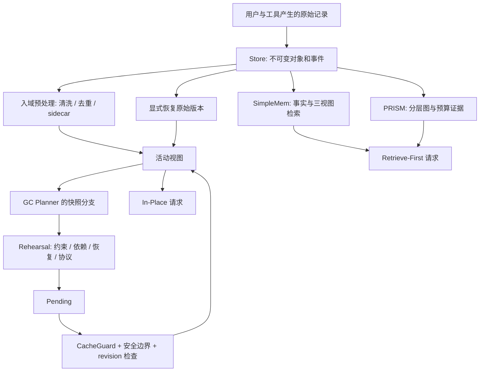

# Context Lab：Agent 上下文治理学习原型

[交互式方法教程](context-lab-explorer.html)：通过八个可操作的视觉案例理解方法，直接用浏览器打开，支持离线使用。

[English README](README.md) · [二次逐页审计](docs/二次实现审计.md) · [原理 → 代码 → 实验](docs/原理到实现.md)

把《Agent 上下文治理思考》及配套讲解中的方法拆成可以运行、修改和观察的 Python 模块。默认无需 API Key，不下载模型，使用 SQLite 保存原始对象、派生记忆、活动视图和事件。

**建议先跑实验，再对照源码读文章。** 本项目覆盖文章中的方法路线；论文算法采用小型机制实现，模型压缩提供真实可选适配器。它不是论文官方实现、生产级 Agent 或 Claude Code/OpenCode 插件。具体差异逐项写在[方法覆盖表](docs/方法覆盖.md)。

最近验证：**55 项测试通过、44 项覆盖引用检查通过、源码包与 wheel 构建通过**。本地运行结果：[基础实验](runs/demo-ztem8jba/report.md) · [融合方法论实验](runs/methodology-j5ciax0o/report.md)。验证范围见[验证记录](docs/VALIDATION.md)。

## 1. 五分钟跑起来

在这个目录执行：

```bash
uv sync --group dev
uv run context-lab demo
uv run context-lab methodology
uv run context-lab coverage --check
```

命令会打印新建的 `runs/demo-…/report.md` 路径。每次运行创建独立目录，不覆盖上一次实验。

| 产物 | 怎么读 |
|---|---|
| `report.md` | 本次运行的变化、缓存决策、校验结果 |
| `01-raw.txt` | 原始历史第一次投影成请求 |
| `02-preprocessed.txt` | 重复读取引用化、重复日志清理后的请求 |
| `03-governed.txt` | fold / mask / prune 后的请求 |
| `04-recovered.txt` | 从归档恢复的旧版本完整代码 |
| `trace.json` | 全部模块的输入、输出、路径、消融和事件 |
| `state/context.sqlite3` | 可跨进程继续读取的状态 |
| `state/sidecars/` | 以内容校验保护的完整输出归档 |
| `training_candidates/` | 带合成标签的 SFT / DPO 候选与审计 |

实验贯穿“支付重试重复扣款”：保留金额约束和错误栈，折叠旧代码，删去已否定猜测；用户再次需要旧代码时，恢复的是归档版本。

```bash
uv run pytest -q
uv run ruff check src tests main.py
uv run context-lab doctor
```

`doctor` 只报告依赖状态，不声称本地模型服务已可用。Python 版本要求为 3.12 或更新版本；依赖由 `uv.lock` 锁定，默认只安装核心项目与开发工具。

## 2. 先理解这张图



这里的“不可变”由数据库触发器保护原始对象的 UPDATE/DELETE；治理修改的是 `views` 表。SQLite 文件仍由本机用户控制，哈希用来发现误损坏，不是防恶意管理员篡改的签名系统。

**计量要分清：**核心的 `count()` 是可重复的教学词法单位，既不是字符数，也不是某家模型的 tokenizer。缓存价格 `write=1.25/read=0.1` 是归一化假设。所有默认报告都不代表真实费用、模型任务成功率或论文 benchmark。

## 3. 用自己的小样本逐步运行

示例 JSON 的每条记录对应一个逻辑对象；工具对象将被投影成完整的调用与结果消息对。

```bash
uv run context-lab ingest examples/session.json --state .context-lab --session learning
uv run context-lab inspect --state .context-lab --session learning
uv run context-lab plan --state .context-lab --session learning
uv run context-lab commit --state .context-lab --session learning --expired
uv run context-lab events --state .context-lab --session learning
uv run context-lab recover learning:tool:2 --state .context-lab --session learning
```

`plan` 只保存通过 rehearsal 的待提交计划。`commit` 可能返回 `committed: false`：变短却不划算时保留 pending。`--expired` 是**实验输入**，表示你假设缓存已经过期；不是工具从真实服务读到的状态。

`ingest` 是追加操作，重复执行会追加新对象。需要干净案例时换一个 `--session` 或状态目录。不要把反复执行 ingest 当作幂等导入。

模拟自动触发器：

```bash
uv run context-lab tick --state .context-lab --session learning --capacity 2000 --future-calls 20
```

它是阻塞式 CLI 便利入口，检查使用率阈值，在独立线程规划后等待结果，再走 rehearsal、pending 与提交。真正非阻塞的宿主接口为 `Runtime.start_gc` / `poll_gc`。API 还支持 `tool_burst`、`phase_end`、`idle` 事件。工具在途时返回 `busy`；计划产生后状态变了则拒绝旧计划。

## 4. 写入和检索结构化记忆

```bash
uv run context-lab ingest examples/memory.json --state .context-lab --session memory
uv run context-lab memory-ingest --state .context-lab --session memory
uv run context-lab query "为什么 Ada 改变支付方案？" --state .context-lab --session memory --entity Ada --budget 150
```

离线写入消费 `metadata.facts` 的显式标注，不把规则提取伪装成自然语言理解。日期可依据 `metadata.date` 锚定；来源 ID 不存在、跨会话或相对日期无锚点时拒绝。相同实体、槽位、值和日期的事实合并来源；时间变化保留多版本；显式 `correction` 才建立 `supersedes`。

检索联合 BM25、哈希向量和实体匹配，再使用倒数排名融合。结果含命中视图、来源、日期与分数。哈希向量是离线词袋近似，**没有神经语义能力**。

## 5. 接上真实模型

### Ollama：自动抽取、摘要与治理规划

先自行准备好 Ollama 服务和模型，再运行：

```bash
uv run context-lab compress examples/notes.txt --method local --model phi3.5 --budget 150
uv run context-lab memory-ingest --state .context-lab --session memory --ollama-model phi3.5
uv run context-lab plan --state .context-lab --session learning --ollama-model phi3.5
```

默认请求 `http://localhost:11434/api/chat`；写入、规划和查询命令可以通过 `--ollama-url` 指定地址。使用标准库 HTTP 调用，`stream=false`、JSON 输出，记录真实服务返回的输入/输出 token 计数到适配器 `last_usage`。连接失败或非法 JSON 直接报错，不偷偷切换到规则结果。模型输出仍经过同一个执行器校验。

### Sentence Transformers：替换检索向量

```bash
uv sync --extra embeddings --group dev
uv run context-lab query "为什么改变方案" --state .context-lab --session memory --embedding-model sentence-transformers/paraphrase-multilingual-MiniLM-L12-v2
```

首次指定模型可能下载权重。Python API 的 `Prism(SentenceEmbedding(...))` 可替换图检索中的向量；BM25 与符号视图保持独立。

### LLMLingua 三代：真实包适配

```bash
uv sync --extra lingua --group dev
uv run context-lab compress examples/notes.txt --method llmlingua --model microsoft/phi-2 --rate 0.5
uv run context-lab compress examples/notes.txt --method longllmlingua --model microsoft/phi-2 --question "为什么需要幂等键？" --rate 0.5
uv run context-lab compress examples/notes.txt --method llmlingua2 --rate 0.5
```

默认设备为 CPU，可用 `--device` 传入上游支持的设备值。模型权重可能较大，推理速度取决于设备；核心 demo 不会触发下载。`rate` 是上游压缩目标，不承诺精确达到同样比例。

CLI 的这三个方法直接调用上游，适合观察 token 压缩行为。应用到 Agent 历史时，应使用 `compression.py` 的受保护文本路径与 `Governor`；**分类器删词得分没有删除整个证据对象的权限。** JSON 适配器和参数路由有测试；本次交付没有下载权重或运行上述神经模型，不能把适配器测试理解成推理质量验证。

如同时需要两组依赖：`uv sync --extra lingua --extra embeddings --group dev`。普通 `uv sync` 会按当前选项重新同步环境。

## 6. 按这个顺序读源码

| 阅读顺序 | 文件 | 对应问题 |
|---|---|---|
| 1 | [types.py](src/context_lab/types.py)、[store.py](src/context_lab/store.py) | 什么是对象，为什么不改原文？ |
| 2 | [projection.py](src/context_lab/projection.py)、[preprocess.py](src/context_lab/preprocess.py) | 原文如何变成活动视图？ |
| 3 | [governance.py](src/context_lab/governance.py) | 谁提出动作，谁验证，何时生效？ |
| 4 | [cache.py](src/context_lab/cache.py)、[runtime.py](src/context_lab/runtime.py) | 压缩何时划算，如何串联？ |
| 5 | [retrieval.py](src/context_lab/retrieval.py) | PRISM 的 N1—N4 如何相互作用？ |
| 6 | [memory.py](src/context_lab/memory.py)、[memgpt.py](src/context_lab/memgpt.py) | 写入型记忆和模型主动分页有什么不同？ |
| 7 | [compression.py](src/context_lab/compression.py)、[providers.py](src/context_lab/providers.py) | 规则、编码器和本地模型如何分工？ |
| 8 | [codemap.py](src/context_lab/codemap.py)、[flywheel.py](src/context_lab/flywheel.py)、[kv.py](src/context_lab/kv.py) | 结构检索、数据飞轮与缓存内部原理 |
| 9 | [demo.py](src/context_lab/demo.py)、[tests](tests) | 看实际正例、反例与组合后的约束 |

## 7. 二次审计补充

新增的 `methodology` 命令贯穿融合图、结构化摘要、分级规划、分区 TTL、模式切换和跨会话模式分析。`coverage --check` 检查 44 个条目的实现与测试引用，不等于论文复现或代码覆盖率。

```bash
uv run context-lab summarize --state .context-lab --session memory --turn 1
uv run context-lab compact-request --state .context-lab --session learning
uv run context-lab codemap src/context_lab --state runs/code-map --query rehearse
```

可选编码器：`uv sync --extra classifiers --group dev`，然后使用 `EncoderClassifier(model_name)` 接入 `tiered_plan` 或 `FusionGraph.build`。这是通用 NLI 编码器适配，不是已经蒸馏好的对象存活模型。

## 8. 扩展与打包

最小模型、向量和分类器接口见 `contracts.py`。可以使用 `with Runtime(...) as runtime` 管理后台线程的生命周期；也支持 `uv run python -m context_lab doctor`。

```bash
uv build
```

源码包和 wheel 写入 `dist/`。源码包使用文件白名单，仅包含代码、测试、示例和说明文档，不包含参考 PDF/HTML、运行状态或临时文件。`coverage --check` 需要包含 `docs/coverage.json` 与测试文件的源码检出；wheel 中的运行功能不依赖这些审计文件。

## 9. 可靠性精进实验

《透彻讲解》新增第 19 章，并在 Self-GC、PRISM、SimpleMem、缓存与评价章节补入实现反例。运行：

```bash
uv run python examples/reliability_walkthrough.py
uv run context-lab resume --state .context-lab --session learning --expired
```

新实验展示暂缓计划跨进程恢复、按完整请求预算装配证据、精确更正与重放。`--expired` 仍是实验假设。记忆更正优先使用 `supersedes: [memory_id]`；模型抽取窗口现在整体校验、事务写入，不留下半次更新。

## 10. 继续学习

- [方法覆盖表](docs/方法覆盖.md)：文章每条路线落在哪，哪些是近似，哪些接了真实库。
- [实验指南](docs/实验指南.md)：逐步修改参数、构造失败案例和观察结果。
- [架构与边界](docs/架构与边界.md)：数据表、协议、预算、缓存、并发和扩展点。
- [原理讲解](Agent上下文治理思考-笔记.md)：回到文章与论文推导。

模型生成摘要仍可能错；这里的校验能发现目标、来源、版本、预算与协议错误，不能证明语义无损。实体识别、矛盾判断、图构建质量、恢复触发率、真实回答质量和真实账单，都需要另外评估。
