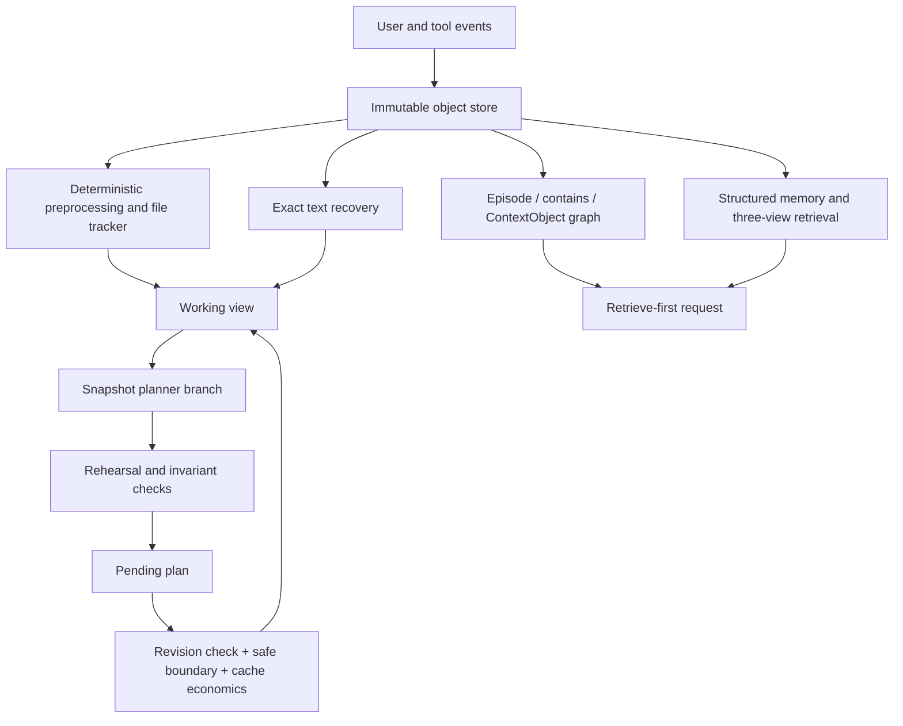

# Context Lab — Agent Context Governance, Explained in Code

[Interactive methodology tutorial](context-lab-explorer.html) — Eight visual, hands-on examples; open the HTML in a browser. Works offline.

[中文 README](README.CN.md) · [Principles-to-code walkthrough (Chinese)](docs/原理到实现.md) · [44-item implementation audit](docs/二次实现审计.md)

Context Lab is a small, inspectable Python implementation of the mechanisms discussed in **“Agent Context Governance”** and its companion explanation. It connects immutable history, working-context projections, recoverable garbage collection, structured retrieval, memory management, prompt caching, and training-data candidates.

The default experiments run **offline, without API keys or model downloads**. Optional adapters call Ollama, Sentence Transformers, Hugging Face encoder classifiers, and all three LLMLingua generations. The project distinguishes executable teaching mechanisms from real model integrations and from capabilities that require a production host.

This is not an official paper reproduction, a production agent, or a plugin installed into Claude Code, Codex, or OpenCode. It does not claim their benchmark results or cost savings.

Latest local verification: **55 tests passed, all 44 traceability entries resolved, and both sdist and wheel builds passed.** The wheel was imported independently of the editable checkout. See [validation scope](docs/VALIDATION.md).

## Quick start

Requirements: Python 3.12+ and `uv`.

```bash
uv sync --group dev
uv run context-lab demo
uv run context-lab methodology
uv run context-lab coverage --check
uv run pytest -q
uv run ruff check src tests main.py
```

Both experiment commands print the path to a new Markdown report under `runs/`. Each invocation creates a fresh directory rather than overwriting a previous experiment.

- **`demo`**: compare raw, preprocessed, and governed context; recover the original code; inspect PRISM ablations, SimpleMem, MemGPT, sleep-time consolidation, code maps, and synthetic SFT/DPO candidates.
- **`methodology`**: follow the article’s proposed fusion architecture: object-backed episodes, typed dependencies, structured summaries, a decision cascade, zoned caching, model-triggerable governance, availability-driven mode switching, and cross-session pattern analysis.
- **`coverage --check`**: validate implementation/test references in the 44-item manifest. This checks traceability, not behavioral correctness or line coverage. Run the tests separately.

## Start with the artifacts

| Artifact | Purpose |
|---|---|
| `report.md` | Human-readable results from this particular run |
| `trace.json` | Inputs, decisions, dependencies, paths, costs, and events |
| `01-raw.txt` | Initial request projection |
| `02-preprocessed.txt` | Exact read deduplication and deterministic cleaning |
| `03-governed.txt` | Context after fold, mask, and prune |
| `04-recovered.txt` | Original archived code, recovered by object ID |
| `state/context.sqlite3` | Persistent objects, views, memories, pending plans, and events |
| `state/sidecars/` | Complete text payloads used by folded references |
| `training_candidates/` | Explicitly synthetic SFT/DPO examples, not a trained model |

The main example concerns duplicate payment charges: preserve the integer-cents constraint and error evidence, fold historical code, remove an explicitly abandoned hypothesis, and recover the original version when requested.

**Measurement:** `count()` uses deterministic lexical teaching units. These are not any provider’s tokens. Default cache prices are normalized assumptions, not current provider prices. Structural evidence checks are not measures of an LLM’s answer accuracy.

## Architecture



Storage, views, and requests are separate:

1. **Objects** preserve the original text, tool arguments, metadata, and explicit dependencies.
2. **Views** select an active, cleaned, aliased, folded, masked, hidden, or distilled representation.
3. **Messages** render logical tool spans as complete tool-call/result pairs.
4. **Memories and graphs** provide derived retrieval structures, always with a distinct trust status.

SQLite triggers prevent normal UPDATE/DELETE operations on raw objects. SHA-256 checks detect accidental corruption. This is not tamper-proof storage against an administrator who controls the database and hashes.

## What is implemented

| Method | Implementation | Important boundary |
|---|---|---|
| Self-GC-style governance | Stable IDs, dependency marking, six-step planner prompt, fold/mask/prune, asynchronous branch, rehearsal, pending, atomic commit, recovery | Independent reference implementation, not the original trained planner |
| PRISM-inspired retrieval | Hierarchical anchors, typed positive-cost paths, intent-sensitive costs, content reranking, evidence budget, N1–N4 ablations | Small graph search; default semantic scoring is a hash-vector approximation |
| Article’s fusion graph | Episodes contain objects; explicit and proposed typed relationships; graph-aware liveness; validated retrieval tuning | Rule hierarchy is intentionally simple; learned relationships need evaluation |
| SimpleMem-style memory | Window gate, explicit facts, reference bindings, date anchoring, provenance merge, versions, vector/BM25/symbolic search | Offline extraction uses annotations; arbitrary natural-language extraction needs a model |
| MemGPT-style management | Core, Recall, Archival; writable memory tools; bounded heartbeat loop; paging; optional semantic recall | Not a complete agent framework or hosted MemGPT service |
| Sleep-time / slow clock | Background snapshot ingestion; cross-session failure communities and supported patterns | Separate extensions; not presented as SimpleMem v3’s original algorithm |
| LLMLingua 1 / LongLLMLingua / LLMLingua-2 | Real upstream `PromptCompressor` adapters | Model weights and neural inference are not run by the default tests |
| Context-diet / file tracker | Terminal cleanup, exact path/version/range/content identity, recoverable folding | Not a host hook; code and sparse evidence are treated conservatively |
| tokenmax / cctx ideas | Versioned Python AST map, symbol search/read, local model compression, source-cited turn JSON | Python-only map; no MCP server deployment |
| DCP ideas | Independent sending view, distillation, bounded `compress_context`, aged failed-input purging | Not installed into OpenCode |
| Caching | Exact-prefix simulator, per-zone TTL checkpoints, append-only compaction request, configurable prices and expected-value calculation | No real provider KV cache access or billing guarantees |
| Decision cascade | Rules → optional encoder → optional local summary → planner → validated executor | A classifier may suggest a recoverable fold; it cannot bypass liveness checks |
| Data flywheel | Benchmark, dependency-closed clean trace, reviewed skill candidate, SFT/DPO candidates | No fine-tuning, RL training, or automatic skill installation |

Every audit entry includes an implementation reference, a test reference, and a limitation in [coverage.json](docs/coverage.json).

## Run your own session

```bash
uv run context-lab ingest examples/session.json --state .context-lab --session learning
uv run context-lab inspect --state .context-lab --session learning
uv run context-lab plan --state .context-lab --session learning
uv run context-lab commit --state .context-lab --session learning --expired
uv run context-lab recover learning:tool:2 --state .context-lab --session learning
uv run context-lab events --state .context-lab --session learning
```

`ingest` appends events. Repeating it is intentionally **not idempotent**; use a new session or state directory for a clean experiment.

`plan` stages only a plan that passes rehearsal. `commit` may return `committed: false` when savings do not justify cache invalidation. `--expired` supplies a hypothetical cache state; it does not inspect a live provider.

Known instruction filenames and common write/edit tool names are automatically protected. Host integrations must still mark other side effects, live handles, exact evidence, and task constraints. Untrusted source documents must not control this metadata.

### Structured memory and turn summaries

```bash
uv run context-lab ingest examples/memory.json --state .context-lab --session memory
uv run context-lab memory-ingest --state .context-lab --session memory
uv run context-lab query "Why did Ada change the payment plan?" --state .context-lab --session memory --entity Ada
uv run context-lab summarize --state .context-lab --session memory --turn 1
```

Offline ingestion uses `metadata.facts`. Relative dates require an explicit source date. Ambiguous dates and invalid source IDs are rejected. Identical canonical facts merge their source sets atomically. Historical changes are retained; an explicit correction may supersede earlier facts.

Turn summaries contain `goals`, `decisions`, `constraints`, `open_questions`, and `artifacts`, each with source IDs. An **exact constraint spine** survives even if a model omits or paraphrases the constraints. A source ID proves traceability, not semantic entailment.

### Code maps

```bash
uv run context-lab codemap src/context_lab --state runs/code-map
uv run context-lab codemap src/context_lab --state runs/code-map --query rehearse
uv run context-lab codemap src/context_lab --state runs/code-map --file governance.py --symbol Governor.rehearse
```

Reading a symbol checks the file hash against the indexed version. Rebuild after changing files. Search ranks symbol names, paths, and docstrings; exact source text is read only after selecting a symbol. Optional embeddings can improve search but are not an ANN index.

## Nonblocking and model-triggered integration

```python
from context_lab.store import Store
from context_lab.runtime import Runtime

runtime = Runtime(Store(".context-lab"), "learning", capacity=4000)
try:
    runtime.start_gc(event="phase_end")
    # Continue independent host work here.
    result = runtime.poll_gc()  # "planning" until ready; never waits for inference.
finally:
    runtime.close()  # Explicit shutdown waits for the worker.
```

Call `poll_gc` again at a later host boundary if it reports `planning`. Once planning completes, later calls also reevaluate persisted pending plans. Any intervening append makes an older plan stale; regenerate instead of silently committing it. `tick()` remains a **blocking CLI convenience**, while `start_gc/poll_gc` are the actual nonblocking API.

A bound `MemoryAgent(..., runtime=runtime)` can call `compress_context` with a turn range. Its request passes through the same executor and cache guard. The model cannot remove a protected object by choosing a different trigger.

`context_for(query, retriever, available=...)` selects retrieve-first when available, otherwise an in-place projection. Only operational retrieval failures trigger automatic fallback; validation errors are not hidden. Live dependencies remain available in both modes. A fallback whose required base context exceeds capacity fails explicitly; retrieved candidates are packed separately against the complete request budget.

## Optional real model backends

Nothing below is installed or downloaded automatically by the offline demos.

### Ollama

Prepare your Ollama service and model first:

```bash
uv run context-lab compress examples/notes.txt --method local --model phi3.5
uv run context-lab plan --state .context-lab --session learning --ollama-model phi3.5
uv run context-lab summarize --state .context-lab --session learning --turn 1 --ollama-model phi3.5
```

The adapter calls `/api/chat` with non-streaming JSON output. Supported session commands accept `--ollama-url`; the default is `http://localhost:11434`. Invalid JSON and transport failures are visible errors, not silent rule fallbacks.

Inspect an append-only structured compaction request:

```bash
uv run context-lab compact-request --state .context-lab --session learning
```

Add `--ollama-model` to send it. The existing system message, tools, and message prefix remain unchanged in this request. Replacing history after receiving a summary is a separate operation that can invalidate caches. Stable request structure alone does not prove a cache hit.

### Sentence Transformers

```bash
uv sync --extra embeddings --group dev
uv run context-lab query "payment plan" --state .context-lab --session memory --embedding-model sentence-transformers/paraphrase-multilingual-MiniLM-L12-v2
```

Use `SentenceEmbedding` with `Prism`, `FusionGraph`, `MemoryAgent`, or `CodeMap.search` through their Python APIs. Loading a model may download weights.

### LLMLingua generations

```bash
uv sync --extra lingua --group dev
uv run context-lab compress examples/notes.txt --method llmlingua --model microsoft/phi-2 --rate 0.5
uv run context-lab compress examples/notes.txt --method longllmlingua --model microsoft/phi-2 --question "Why are idempotency keys needed?" --rate 0.5
uv run context-lab compress examples/notes.txt --method llmlingua2 --rate 0.5
```

CPU is the default device. These models may be large and slow. The CLI deliberately exposes raw upstream compression for experimentation; use the protected `compression.py` path and the Governor when integrating compressed text into an agent.

### Encoder classification

```bash
uv sync --extra classifiers --group dev
```

```python
from context_lab.providers import EncoderClassifier
from context_lab.planning import tiered_plan

encoder = EncoderClassifier("FacebookAI/roberta-large-mnli")
plan = tiered_plan(snapshot, classifier=encoder)
```

This is a generic NLI encoder example, not a trained context-liveness classifier. Its confidence is not calibrated for this task or every language. The same interface can classify candidate graph relationships. Low confidence escalates or abstains; all resulting actions still require rehearsal.

Combine extras in one `uv sync` command when needed. A later plain `uv sync` resynchronizes the environment to its selected extras.

## Cache economics

Let `I` be the old suffix length after the first changed position, `J` the new suffix length, `S=I−J`, `N` the expected future uses, `r` the cache-read price, `w` the cache-write price, and `G` the remaining incremental cost.

```text
Valid cache:   N*S*r - J*(w-r) - G
Expired:      S*w + (N-1)*S*r - G
```

A positive value favors committing. `forecast_value` also accounts for hit probability and planner cost **before planning**. Already-paid planner cost is not charged again when deciding whether to commit an existing plan.

The implementation does not hard-code the article’s illustrative 30%/15%/40% thresholds as universal rules. Editing uncached dynamic text can still invalidate a cached checkpoint after it, because cache keys contain the entire preceding prefix.

## Reading order

1. `types.py`, `store.py`: identities and immutable records.
2. `projection.py`, `preprocess.py`: working views, protocol integrity, file identity.
3. `planning.py`, `governance.py`: proposals versus execution authority.
4. `runtime.py`, `cache.py`: triggers, races, modes, and economics.
5. `retrieval.py`, `fusion.py`: episode retrieval and object-level dependencies.
6. `gating.py`, `memory.py`, `summaries.py`, `memgpt.py`: writing, retrieving, paging, and consolidating memory.
7. `providers.py`, `compression.py`: optional inference and tiered compression.
8. `codemap.py`, `flywheel.py`, `kv.py`: specialized indexing, auditable candidates, and causal attention intuition.
9. `demo.py`, `methodology.py`, `tests/`: observable behavior and failure cases.

## Reliability walkthrough

```bash
uv run python examples/reliability_walkthrough.py
uv run context-lab resume --state .context-lab --session learning --expired
```

Deferred plans survive runtime restarts and can be reevaluated without another planner call. Commit checks both the source revision and the exact selected proposal. The scheduler APIs assume one host scheduling owner; they do not provide a distributed work queue.

`pack_evidence` preserves whole evidence and source IDs while checking the fully serialized request, a separate body budget, and an optional output reserve. Oversized candidates are reported as omitted, and later smaller candidates may still fit. Candidate retrieval and actually sent evidence are distinct outputs; this greedy selection is not globally optimal.

Memory ingestion validates a complete extraction window before a transaction writes it. Prefer explicit `supersedes: [memory_id]` for corrections. Cyclic corrections are rejected, and repeated ingestion preserves source unions and correction relationships. `observed_seq` records within-session observation order, not full bitemporal validity.

The companion explanation adds sections 4.13, 5.12, 6.12, 8.16, 13.8 and chapter 19 to explain these implementation boundaries.

## Packaging and extension contracts

`contracts.py` defines the minimal `JSONModel`, `Embedder`, and `Classifier` protocols. `Runtime` supports context-manager cleanup. The module entry point is `uv run python -m context_lab doctor`.

```bash
uv build
```

The source distribution uses an explicit allowlist for code, tests, examples, and documentation. User reference PDFs/HTML, temporary files, and generated state are excluded. The wheel contains the runtime package. `coverage --check` requires the source checkout, including its manifest and test files; normal runtime commands do not.

The checked-in README links to locally generated reports only in the Chinese entry page; regenerate reports with the demo commands when working from a fresh source distribution.

Provider normalization is deterministic: internal JSON-string tool arguments become Ollama objects, and tool result names become `tool_name`. The same conversion is applied to both the original and appended compaction prefixes, without mutating the stored records.

## Limits and sources

Neural inference, semantic fidelity, production task accuracy, actual provider billing, and model training have not been validated by the offline experiments. Binary multimodal recovery is not implemented; non-text objects are protected from text folding. This repository has no production host hooks, authentication service, or multi-tenant isolation.

Primary references: [Self-GC](https://arxiv.org/abs/2607.00692), [PRISM](https://arxiv.org/abs/2605.12260), [SimpleMem](https://arxiv.org/abs/2601.02553), [MemGPT](https://arxiv.org/abs/2310.08560), [LLMLingua](https://github.com/microsoft/LLMLingua), [Ollama Chat API](https://docs.ollama.com/api/chat), [Sentence Transformers](https://sbert.net/docs/quickstart.html), and [Hugging Face pipelines](https://huggingface.co/docs/transformers/en/main_classes/pipelines).

The mechanism-level coverage and corrections to the original article are documented in the [implementation audit](docs/二次实现审计.md). In particular, PRISM includes compression/selection, SimpleMem v3 is not the article’s proposed slow-clock system, and coding operations are not universally idempotent.
