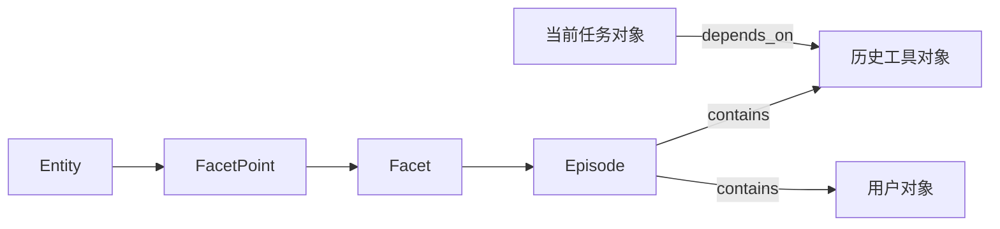

# 从原理理解到自己实现：Context Lab 的第二条学习路径

这篇文档配合[完整原理讲解](../Agent上下文治理思考-笔记.md)阅读。原理讲解解释“为什么”；这里解释“状态怎样表示、函数怎样连接、失败时怎样处理”。建议按顺序运行，不要一开始就把所有组件接进真实 Agent。

先执行：

```bash
uv run context-lab demo
uv run context-lab methodology
uv run context-lab coverage --check
```

第一份报告看单项机制，第二份报告看融合。覆盖清单的 44 个条目包含可执行机制、真实可选适配器和明确的保护边界；它不等于复现了所有上游代码或论文成绩。

## 1. 先写状态，再写“聪明”的模型

对应原理讲解 §2、§4、§10.1。

最小状态可以写成：

```text
原始对象 O = (session, id, turn, content, tool_arguments, metadata, dependencies)
视图 V[id] = active | alias | folded | masked | hidden | distilled
派生记忆 M = (fact, entity, date, source_ids, supersedes)
计划 P = (session, source_revision, actions)
```

真正的区别是数据的承诺不同：O 承诺保存历史事实；V 决定这次发送什么；M 提供检索入口；P 只是尚未取得执行权的建议。

在 [store.py](../src/context_lab/store.py) 看 `append`、`snapshot`、`commit`。`append` 不接收模型生成的“新系统指令”，只记录数据。已知 AGENTS.md/SKILL.md/CLAUDE.md 文件读取会被保护；常见 write/edit 名称自动标记副作用。其他工具必须由宿主正确标记。

自己实现时先验证三件事：对象 ID 不会复用；不同会话 ID 不能互相替换；修改活动视图后还能找到原始对象。测试入口：`test_fold_restart_recovery_protocol_and_raw_immutable`。

## 2. 对象的“存活”与文本的“重要”分别实现

对应 §4.2—4.8、§7.5。

`dependency_closure` 从当前任务根沿 dependencies 遍历。闭包回答的是“为了保持当前任务可继续，哪些对象必须可达”，不是词语的显著性评分。

`planning.tiered_plan` 实现四档：

```text
明确规则能决定？ → 规则动作
否则编码器达到阈值？ → keep 或可恢复 fold 建议
否则本地模型能给较短且自认有把握的摘要？ → distill 建议
否则交给完整 planner；没有 planner 时 abstain，继续保留
```

即使编码器说“redundant background，0.98”，也只建议 fold；最终要经过 Governor。置信度不是事实正确率，更不是删除权限。

示例：

```python
from context_lab.planning import tiered_plan
from context_lab.providers import ReplayModel

plan = tiered_plan(
    snapshot,
    local_model=ReplayModel([{"summary": "派生背景摘要", "confident": True}]),
)
# plan.trace 显示每个对象在哪一档做了决定。
# governor.stage(plan) 才会执行保护、依赖、来源与预算相关检查。
```

ReplayModel 只是让控制流可观察；替换为 Ollama 后才是实际模型推理。可选 `EncoderClassifier` 使用 Hugging Face NLI pipeline，它不是已经训练好的 Self-GC 存活分类器。相关测试分别覆盖 abstain、本地摘要、非法模型目标和编码器调用契约。

## 3. 把原文六步规划变成明确接口

对应 §4.8—4.12。

在 [planning.py](../src/context_lab/planning.py) 阅读 `GC_PROMPT`，按顺序要求：

1. 排除不合格对象。
2. 分析直接与桥接依赖。
3. 判断显式废弃。
4. 选择工具粒度，整轮折叠仅作例外。
5. 选择动作。
6. 校准收益与风险，允许空计划。

不能仅仅在提示词里说“注意安全”。执行器会再次检查：用户 span 仅允许 keep/fold；当前轮、媒体、指令记录、活跃句柄和副作用记录不能改；稀疏证据不能 mask；重复、越界、未知 ID 不能执行。

`mask` 现在按行保留首尾各 10%，中间插入恢复标记。这个比例是明确的教学选择，不是推断“中间 80% 一定无用”。只对调用方标记为重复日志的内容允许该操作。`purgeErrors` 则不同：保留完整错误消息，包括错误栈，只缩短达到指定年龄的失败调用输入。

规则 planner 会略过很短的 fold 候选，因为引用包装可能比正文更长。正式成本判断仍基于完整请求，而不是单独比较正文长度。

## 4. 异步不是把函数放进线程后立即等待

对应 §4.9—4.10、§10.4。

上一版 `tick()` 调用线程后立刻 `.result()`，因此只是规划内部用了线程，调用者仍被阻塞。本版保留它作为 CLI 便利函数，并增加真正分开的接口：

```python
runtime.start_gc(event="phase_end", model=your_model)
# 主程序继续处理不依赖规划结果的工作。
status = runtime.poll_gc()
# 若 status 为 planning，在下一次宿主边界再 poll，不要忙等。
```

模型生成期间如果用户追加一条约束，数据库 revision 改变。旧计划完成后应得到 stale，重新规划。不要把旧计划套用到新历史。`test_nonblocking_start_poll_and_stale` 使用线程事件精确构造这个竞争条件，而不是依靠不稳定的 sleep。

`close()` 会等待线程结束，适合进程关闭；不要每一轮都创建并关闭 runtime。这个线程池不是可靠分布式队列，进程退出会失去尚未完成的推理任务，但原始事件仍在数据库。

模型也可调用 `MemoryAgent` 绑定的 `compress_context`，只传目标轮次范围。模型不能把缓存声明成 expired，或自己改写价格以绕过成本门控。缓存状态属于宿主控制面。

## 5. Episode 与 ContextObject 真正连起来

对应 §5、§10.1、§11。

上一版两种结构并列存在，没有 `contains` 连接。本版 [fusion.py](../src/context_lab/fusion.py) 的 `FusionGraph` 把它们接起来：



`build(snapshot)` 创建基本层级、轮次 Episode、contains、显式依赖和顺序 temporal 边。不能因为两条消息相邻就认定因果，所以 causal/semantic/evolution 关系要靠明确资料或可选分类器/模型建议。

构边成本同样分档：规则 → 高置信编码器 → 一次批量模型兜底。候选目前限于相邻对象对，便于观察而且避免全量 O(n²) 模型调用；复杂应用需要更好的候选召回。

```python
graph = FusionGraph().build(snapshot, classifier=encoder, model=model)
graph.save(store)
governor = Governor(store, graph=graph)
```

`Governor` 使用这些边保守地增加存活对象。模型边不能删除既有显式依赖。构图后原始对象增加会让图指纹过期；仅改变视图不改变原始对象，因此无需为了每次 fold 重建图。

`FusionGraph.tune(inactive=[...], edge_costs=[...])` 实现检索侧失效标记与边权更新；只改变检索行为，不等同于把原始数据删除。模型自动学习如何调权仍不在本原型验证范围内。

## 6. “检索到”之外，还要检查“是否漏掉已知依赖”

对应 §5.10—5.11、§11.6、§15.3。

Retrieve-First 的请求由两部分组成：任务保护闭包 + 本次检索证据。只保留当前用户消息、隐藏所有历史，会把当前消息明确依赖的旧代码一并隐藏。二次审计修复了这个问题。

更细的情况：某对象上轮已经 hidden，用户这轮突然通过 dependencies 明确引用它。`required_view` 会将其恢复为本次可见正文；masked/distilled 也不能当作精确依赖的替代品。folded 则可以保留可校验的恢复引用。

```python
runtime.context_for(query, retriever=graph, available=True)
runtime.context_for(query, available=False)
```

第二次切到 In-Place。函数只捕获连接、超时、文件缺失等可用性故障，不能把格式错误、图过期或预算不足伪装成“网络坏了”。本地原始存储也不可访问时，不能承诺恢复。fallback 仍超预算会报错，要求治理后再试。

## 7. 三种“摘要”不要共享一个无类型字符串

对应 §6、§7、§9.3、§11.10。

这里区分：

| 数据 | 写入入口 | 用途 |
|---|---|---|
| 原子事实 | `SimpleMemory.ingest` | 以后按实体、事件日期、语义查询 |
| 轮次 JSON 摘要 | `TurnSummaries.write` | goals / decisions / constraints / open_questions / artifacts |
| 活动对象 distill | `Governor.rehearse` | 临时替换一个非关键工具对象的发送正文 |

轮次摘要每个 item 必须引用本轮有效 source IDs。额外保存 `exact_constraints`，防止“反复摘要后禁止条件逐渐消失”。它不是语义验证器：一个模型可以引用真实 ID 但写错结论，仍需任务级核查。

```bash
uv run context-lab summarize --state .context-lab --session learning --turn 1
uv run context-lab summarize --state .context-lab --session learning --turn 1 --ollama-model phi3.5
```

不传模型时做保守的抽取式分组；传模型后才会生成更短的新表述。两条路径都保存来源指纹与派生标记。

SimpleMem 的 gate 对明确寒暄可跳过，对未知内容宁可交给抽取器。字段规范化的事实合并现在在 SQLite 事务中合并来源集合，避免两个后台写入相互覆盖。BM25 的文档频率也改为每次查询统一计算，去掉原来针对每篇文档重复扫描文档集的开销。

## 8. 四分区缓存与两个决策时点

对应 §8 全章，尤其 §8.14—8.15。

`prompt_zones` 产生 static → history → dynamic → recent 四个区域；`ZonedCache` 的 checkpoint 记录**从请求开头到该区域末尾**的精确内容和 TTL。

```python
cache = ZonedCache()
cache.request(prompt_zones(snapshot, dynamic="A"), now=0)
cache.request(prompt_zones(snapshot, dynamic="B"), now=1)
cache.request(prompt_zones(snapshot, dynamic="C"), now=400)
```

修改 dynamic 不影响前面的 checkpoint；如果你在 recent 末尾也设置缓存，那么它包含 dynamic，修改 dynamic 仍会让它失效。“这个区域不缓存”不等于修改它没有后续成本。

`forecast_value` 是规划前的期望收益，要减去尚未发生的 planner 成本；`Governor.commit` 是规划完成后的增量决定，不重复扣掉沉没成本。供应商折扣、命中概率、复用次数都是输入，不凭供应商品牌固定指定 30% 或 15%。

`compaction_request` 和 `Ollama.generate_messages` 增加了结构化的缓存友好请求路径：保持原有 system、tools 和 messages，只追加压缩要求。

```bash
uv run context-lab compact-request --state .context-lab --session learning
```

默认只打印请求。加 `--ollama-model` 才发送；生成摘要后是否替换原历史，是下一次提交的成本判断，不能把两个步骤混成“完全不破坏缓存”。

## 9. 慢循环要产生有来源的假设，而不是凭空总结

对应 §10.7、§13。

原文提出跨会话模式学习，但所提供 SimpleMem v3 并没有要求这条后台阶段。因此本版把它放在独立函数 `consolidate_patterns`：输入多个会话的 failure 事件，按共同故障标签连边，计算连通分量和有独立会话支持的模式。

输出是“有两个会话都标注了 stale-file”，不是“已证明失败根因是 X”。没有把小样本的共同出现升级为因果结论。复杂的神经抽象或社区发现算法可以替换这一实现，但仍应保留支持来源。

`clean_session` 另外输出 benchmark、dependency-closed golden trace 和待审核 skill candidate。被标记为 retry 的工具如果是副作用操作，或被成功路径依赖，仍必须保留。skill candidate 不会自动安装成 SKILL.md，以免源材料变成未来的高权限指令。

## 10. 从这个雏形走向自己的工程

建议按以下里程碑实现，每一步都先保持同样的不变量测试：

1. **换 tokenizer 与预算器**：把 `count` 替换为目标模型计量，包括模板、工具 schema 和输出预留；不要只统计正文。
2. **换真实宿主消息接口**：保存自己的原始日志，确认宿主支持发送前转换。普通工具本身未必能改历史。
3. **接实际模型并录制轨迹**：记录延迟、输入输出 token、错误类型和恢复调用；让模型与规则跑同一批任务。
4. **改进语义判断**：用标注集校准分类器、评估摘要蕴含与否定保留、提高图构边召回，避免过度依赖自报 confidence。
5. **加入故障恢复**：归档不可读、索引过期、推理超时、任务重启、消息并发追加都应有可预测行为。
6. **评估单位成功任务成本**：比较 raw / preprocess / GC / retrieve-first / combined；同时看证据可达率、真实答案质量、恢复次数和总延迟。

当前 repo 提供的是可执行机制、明确边界和回归测试。模型权重训练、真实服务缓存效果、完整多模态恢复与生产部署仍需独立实现和评测，不能用“44 项可追溯”替代这些工作。
